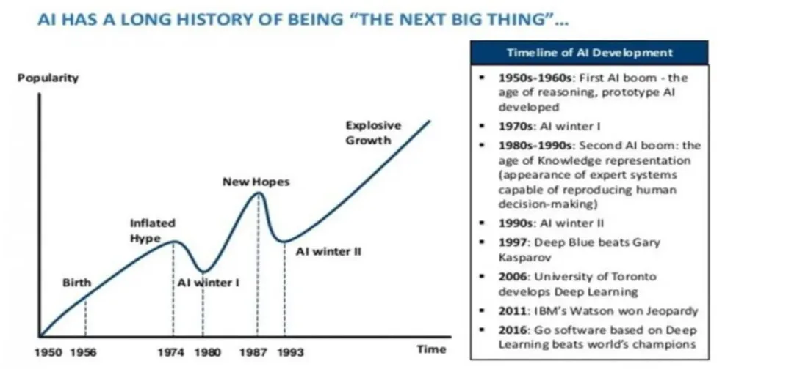
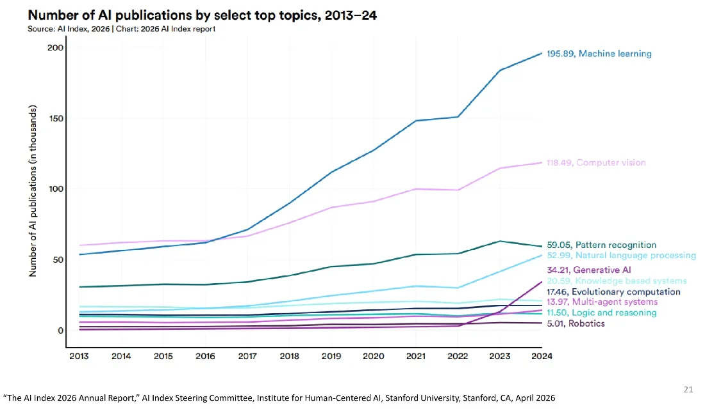
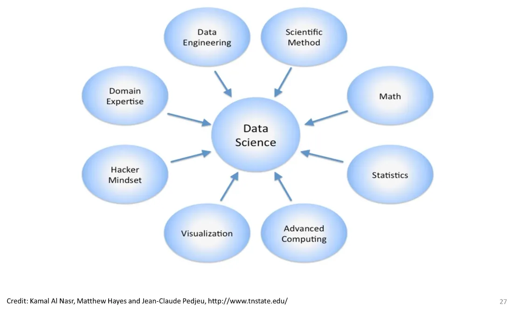
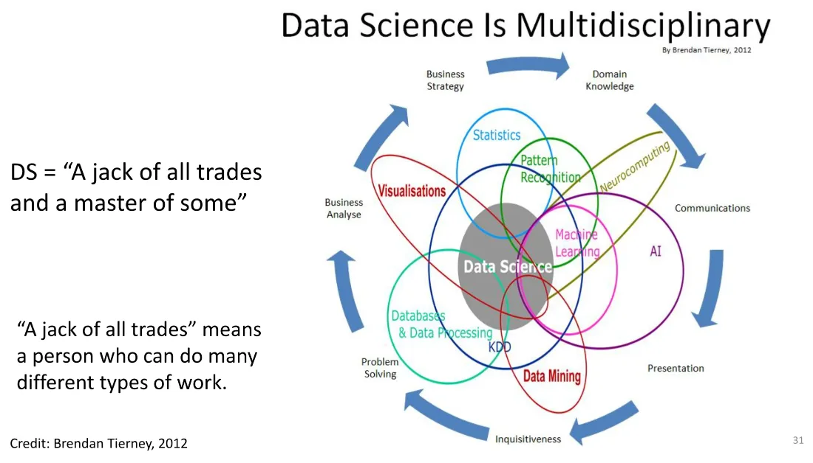
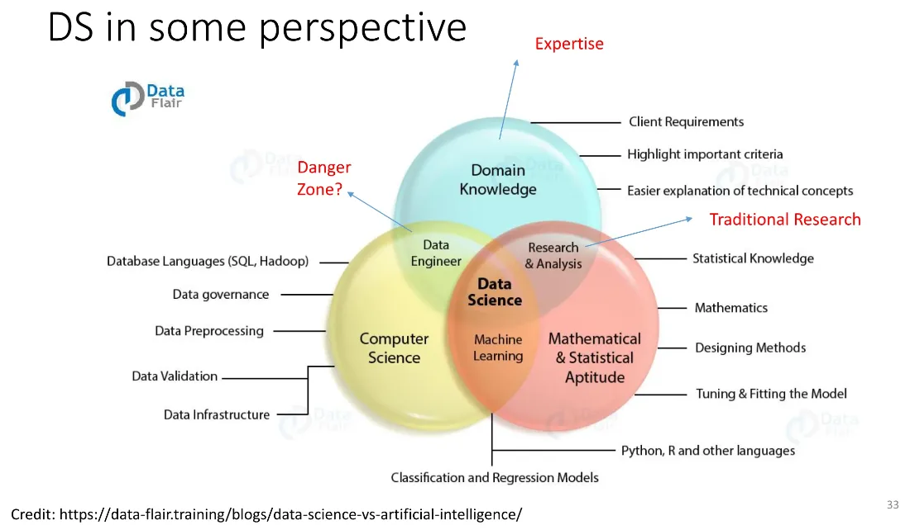
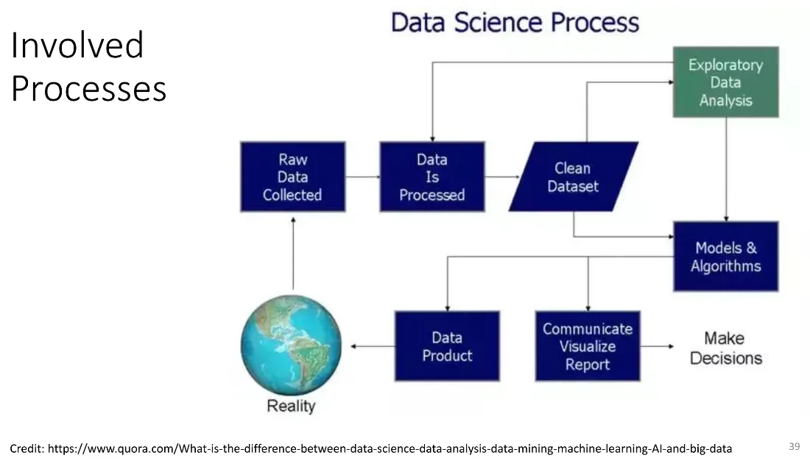
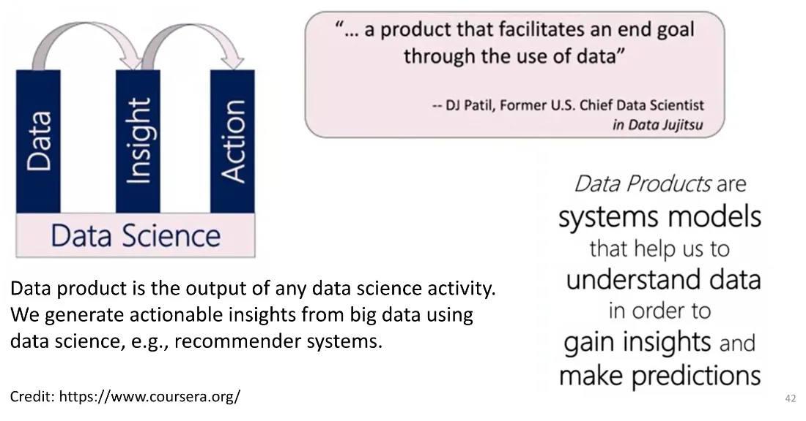
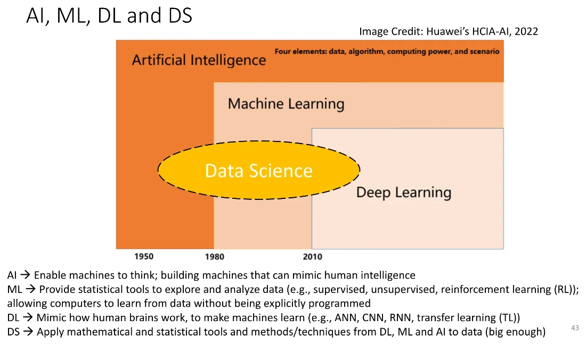
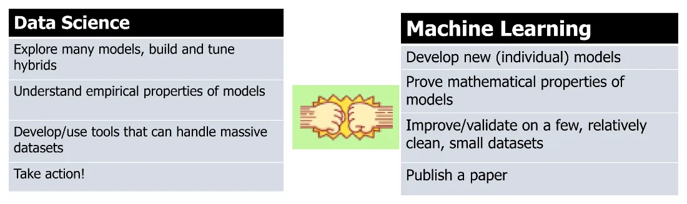
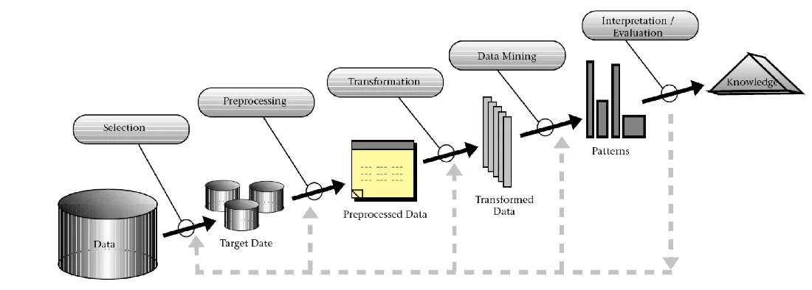

> Group 2 (Friday 13.00–16.00 @ LX 12/1) — built on the deck `INT182_01_Intro-to-DS-Engineering-and-AI.pdf` (51 slides, Assoc. Prof. Dr. Pornchai Mongkolnam), from slide 19 to slide 51, which is the stretch taught as a continuation of last week, with additions from what the lecturer said in class (`INT182_G2_20260814.docx`)
>
> ⚠️ The transcript comes from automatic speech recognition and is poor quality in several stretches (wrong words, broken sentences) — anything drawn from the transcript alone is marked *(from the transcript)*, and only what could be read with confidence is kept
>
> At the end of the session the lecturer opened the next deck (EDA & Model Fitting) and got about 16 slides in. All of that material lives in the Week 3 note, so that one topic does not end up split across two files

## Agenda

1. Recap of the AI winter → the indicators of where AI is heading
2. How much data the world produces, and two quotes worth remembering
3. Where the terms Data Science and Data Scientist come from
4. Big Data — 5 V's + 2 V's, and structured vs unstructured
5. What data science actually does — the pipeline, life cycle and 4 A's
6. The team, and the work on the data engineering side
7. How AI, ML, DL and DS differ
8. KDD and data mining
9. Dataset sources and tools
10. Hands-on: Orange Data Mining

## 01 Recap — AI has its ups and downs (hype and winter)

Last session stopped at the graph of AI's evolution, the one that rises and falls. The stretches where it collapses are called an **AI winter**.

*(from the transcript)* The lecturer explained where the word winter comes from: it is like the cold season, when there is little activity and animals ==hibernate==. During an AI winter, activity in the field goes quiet, **investment dries up**, and little money arrives from either government or the private sector. Then it comes back up again — it is a **cycle**. Right now we are on the way up, and IT market indices carry valuations and market values so high that plenty of people are watching them nervously.

## 02 The indicators of where AI is heading

Two slides draw on **“The AI Index 2026 Annual Report,” AI Index Steering Committee, Institute for Human-Centered AI, Stanford University (April 2026)**.

- **AI Publications** — publication counts act as an index of which organisations and institutions are actually doing research. *(from the transcript)* Government bodies, private companies and universities all publish, and most of it comes out of ==R&D== work
- **AI Publications by Fields** — shows which sub-fields under the AI umbrella people are researching. *(from the transcript)* The ones the lecturer listed: machine learning, computer vision, machine vision, pattern recognition, NLP, generative AI, robotics
- **AI Rankings** — <https://airankings.org/> shows, for each field, where the research is happening and where the experts, faculty and master's/PhD students are. *(from the transcript)* He compared it with ==CS Rankings==, which is broader, while AI Rankings is more specific; the data is refreshed periodically

*(from the transcript)* The definitions stressed in class:

- **Machine learning** — making a machine learn and get smarter from data on its own, **without a programmer writing out the steps explicitly**. We only feed in data to train on
- **Computer vision (CV)** — bound up with ==image processing==; used to detect and recognise faces, or to identify and distinguish objects inside an image
- **Machine vision** — applying computer vision to factory hardware and equipment, for instance automated systems that must recognise or count things. The example the lecturer had seen first-hand was a CP grilled-chicken plant near Minburi, where cameras capture the grilled pieces coming off the line and analyse whether any are burnt, what the quality is, and whether the count is complete — all without a person doing it

## 03 How much data the world produces per day

| Value | Meaning |
|---|---|
| Quintillion | 1018 = million × million × million |
| Exabyte | 1 quintillion bytes |
| In 2025 | About **400 quintillion bytes of new data per day** worldwide, and still climbing as AI adoption accelerates |
| As DVDs | Roughly **95–120 billion** standard DVDs (4.7 GB each) every single day |

(The figures on the slide cite an answer from ==DeepSeek==, July 2026.)

*(from the transcript)* This data arrives in many forms and from many sources — video streaming, music, images, text and so on. The point the lecturer closed on: **more data does not automatically mean better**. If you have a mountain of it but cannot process it, none of it does you any good.

## 04 Two quotes worth remembering

### “Data is the new oil” — Clive Humby (2006)

> “Data is the new oil. It’s valuable, but if unrefined it cannot really be used. It has to be changed into gas, plastic, chemicals, etc to create a valuable entity that drives profitable activity; so must data be broken down, analyzed for it to have value.”

Clive Humby is a British data commercialization entrepreneur, and the ==World Economic Forum== picked the phrase up in a 2011 report.

### “AI is the new electricity” — Andrew Ng (2016)

Andrew Ng is the former Chief Scientist at ==Baidu==, a co-founder of Coursera, and an adjunct professor at Stanford.

> “Anything that a typical human can do with at most 1 sec of thought, can probably now or soon be automated with AI.” — an imperfect rule, but quite a helpful one.

Why the comparison holds: about a century ago the world electrified, replacing steam-powered machines and transforming transportation, manufacturing, agriculture and healthcare. AI is now poised to drive a transformation of similar scale across many industries. (A note on the slide: 5G latency is about ==single-digit milliseconds== at best.)

*(from the transcript)* The lecturer tied this to the word **democratize** — AI is something everyone can reach, the way electricity is, rather than something confined to one group. It may not be free, but it is within reach at a reasonable price, much like the monthly phone and internet bills we already pay.

## 05 Where the terms Data Science and Data Scientist come from

| Term | Year | Who |
|---|---|---|
| **Data science** | 1974 | **Peter Naur** proposed it as an alternative name for computer science |
| **Data scientist** | 2008 | Coined by **DJ Patil** and **Jeff Hammerbacher** |

*(from the transcript)* Peter Naur was a well-known figure in programming languages, one of the people who laid down the rules and grammar for computer languages in the 1960s and 1970s — the era of ==Fortran and ALGOL==, before Java, C++ and Python. So the idea of data science goes back a long way, but it never spread widely, and computer science is still the term in use. Note that **data scientist came after data science**, and that it names a *role* rather than a field of study.

The definitions the slides quote:

- **Jeffrey Stanton (Syracuse University)**: “Data Science refers to an emerging area of work concerned with the collection, preparation, analysis, visualization, management and preservation of large collections of information.”
- **Hilary Mason (chief scientist at bit.ly)**: “A data scientist is someone who can obtain, scrub, explore, model and interpret data, blending hacking, statistics and machine learning.” — someone who gets hold of the data, cleans it up (scrubs it), explores it, builds a model and interprets what that model says

### DS = “A jack of all trades and a master of some”

(==Brendan Tierney==, 2012) — someone who can do many kinds of work but is genuinely expert in only a few. *(from the transcript)* The lecturer compared it to a **duck**, which can fly and swim but may not be outstanding at either.

The slide titled “DS in some perspective” also marks out a **danger zone** — the region where you work on data alone without any theory to support it.

## 06 Big Data — 5 V's + 2 V's

| V | Meaning |
|---|---|
| **Volume** | Sheer quantity; probably the best-known characteristic of big data |
| **Velocity** | The speed of incoming data and of processing it |
| **Variety** | The range of data types, arriving from many sources |
| **Veracity** | Data quality, cleanliness and accuracy — confidence and trust in the data |
| **Value** | Information for decision-making — the slide calls it arguably the most important of all |
| + **Variability** | Meaning that shifts with context, or inconsistencies in the data and in the speed at which it loads into your database |
| + **Visualization** | Making the collected and analysed data understandable and easy to read |

### Structured vs Unstructured

| Type | Characteristics | Examples |
|---|---|---|
| **Structured** | Clear structure, easy to access and analyse | Tables, relational databases (with an explicit primary key) |
| **Unstructured** | No clear structural form | Text and comments, video, music, images, multimedia |
| **In between** *(from the transcript)* | Carries tags or partial structure; some people put it in the middle | XML, JSON |

*(from the transcript)* An example of using unstructured data: the comments under a video clip have to be mined for keywords, the word frequencies examined, and then judged as positive or negative sentiment — which is exactly what ==LLMs and generative AI== do today.

## 07 What data science actually does

### The main components

Data Collection → Data Cleaning and Preparation → Exploratory Data Analysis (EDA) → Data Modeling → Evaluation → Data Communication and Visualization

### The practical definition — DS is the whole pipeline

A data scientist understands and cares about **the whole pipeline** of extracting information out of data, which comes in three steps (==Tim Kraska==):

1. **Preparing to run a model** — gathering, cleaning, integrating, restructuring, transforming, loading, filtering, deleting, combining, merging, verifying, extracting, shaping
2. **Running the model**
3. **Communicating the results**

*(from the transcript)* The lecturer explained the word pipeline as ==upstream / midstream / downstream== — a workflow that passes work along step by step, much like the way things are done in software engineering.

### The DS life cycle

1. Requirement engineering
2. **Feature engineering** — using ==domain knowledge== to extract features (characteristics, properties, attributes, variables) from raw data
3. **Feature selection** — choosing the subset of features that genuinely matter
4. Modelling
5. Deployment and maintenance

### The 7 key steps of DS work

| Step | Note from the slide |
|---|---|
| 1. Business problem | Ask “why” questions — the slide puts it as playing the part of an inquisitive young novice monk |
| 2. Data acquisition | |
| 3. Data preparation | Cleaning and transformation — **the most time-consuming process** |
| 4. Exploratory data analysis | Features and parameters — **the most important step** |
| 5. Data modeling | Data mining, machine learning, deep learning — **the most technical part** |
| 6. Visualization and communication | |
| 7. Deployment and maintenance | |

*(from the transcript)* All of this is a **cycle**, not a straight line — once it is deployed for real and users start using it, you collect ==feedback== and loop back round to improve it.

### The 4 A's of Data Science

The roles data scientists play, or help others play (==Saltz & Stanton==, 2018)

| A | Meaning |
|---|---|
| Data **Architecture** | Designing the architecture of the data system |
| Data **Acquisition** | Getting hold of the data / data collection |
| Data **Analysis** | Analysing the data |
| Data **Archiving** | Keeping records so they can be searched and retrieved later *(from the transcript: compared to a national archive, or to version control, which tells you who changed what and when)* |

## 08 The data science team, and the work on the data engineering side

| Role | What they do |
|---|---|
| **Data scientist (DS)** | Prepares data and engineers features — the most valuable skill is training models |
| **Data engineer (DE)** | Focused on data acquisition; builds data pipelines — a 5:1 DE:DS ratio is not uncommon |
| **Data analyst (DA)** | Assists the DS with data preparation |
| **Application architect (AA)** | Designs the complete solution; deploys and maintains models in production |

### What data engineering covers

- **Data pipelines** — efficient, reliable systems for moving data from various sources (databases, APIs, files) to storage and processing platforms
- **Data storage** — selecting and managing the right storage for the data's characteristics and query patterns (relational databases, data warehouses, ==data lakes==, NoSQL)
- **Data transformation** — cleaning and transforming raw data into a form fit for analysis
- **Data quality** — accuracy, completeness, consistency and timeliness
- **ETL (Extract, Transform, Load)** — *(from the transcript: some places call it ==ELT==, whichever suits)* pull the data out → transform, clean and reformat it → load it into the database ready for analysis

The tools the slides name: SQL, NoSQL, Hadoop, Snowflake, Apache Spark, Airflow, Kafka, the languages Python, Java and ==Scala==, and the AWS / Azure / GCP clouds.

## 09 Data product → insight → actionable

**A data product is the output of any data science activity** — a ==recommender system==, for instance. We generate actionable insights out of big data using data science.

*(from the transcript)* Compare it with the **work product** of software engineering (requirement spec, test plan, test case, project plan, risk plan, prototype) — the data science side has its own data products, whether that is the model itself, its weights, or the datasets used to train and test it.

Two words to keep apart:

- **Insight** = a thorough, deep understanding gained from analysing the data
- **Actionable** = if you do X, how will Y improve — once you have the insight you must be able to **take action** on it, for instance analysing the data, finding the point where your product loses to a competitor, and putting resources into that point

## 10 How AI, ML, DL and DS differ

| Abbreviation | Definition on the slide |
|---|---|
| **AI** | Enable machines to think — building machines that can mimic human intelligence |
| **ML** | Provide statistical tools to explore and analyse data (supervised, unsupervised, reinforcement learning), letting computers learn from data without being explicitly programmed |
| **DL** | Mimic how human brains work so machines can learn (ANN, CNN, RNN, transfer learning) |
| **DS** | Apply mathematical and statistical tools and techniques from DL, ML and AI to data (that is big enough) |

*(from the transcript)* The additional explanations:

- **AI is the broadest** — it mimics human *intelligence*, by whatever means. A two-legged robot that can do a somersault or play ping-pong counts as AI
- **DL mimics the human *brain*** — artificial neural networks, of several kinds, such as CNNs for ==image classification== and RNNs that feed information back round
- **ML is part of AI but not all of AI** — look at the colours of the ellipses on slide 43
- **DS borrows other people's techniques** rather than inventing new ones, and concentrates on applying numbers and statistics to real data
- The rough timeline given in class: AI around 1950 → machine learning ==around 1980== → deep learning around 2010 → LLMs and ChatGPT around 2022–2023 (just after COVID)

### DS vs ML

| Machine Learning | Data Science |
|---|---|
| Develop new (individual) models | Explore many models, build and tune hybrids |
| Prove mathematical properties of models | Understand the empirical properties of models |
| Improve and validate on a few relatively clean, small datasets | Develop and use tools that can handle massive datasets |
| **Publish a paper** | **Take action!** |

(==Daisy Zhe Wang==, University of Florida, 2015)

## 11 KDD and data mining

**KDD = Knowledge Discovery in Databases** — a broad term covering data science, data mining, databases, visualization and statistics all at once (see the diagram on slide 47). The process runs: throw the data into a database or data warehouse → selection → preprocessing → ==transformation== → **data mining** to find patterns → interpretation → knowledge.

**Data mining (DM)** is the process of garnering information from huge databases that was previously incomprehensible and unknown, and then using that information to make relevant business decisions — a set of methods used in knowledge discovery to surface relationships and patterns nobody knew about. It is a confluence of AI, data management, ==pattern recognition==, visualization, machine learning and statistics.

*(from the transcript)* A **data warehouse** is a large, varied database, and the crucial point is that it **must carry time stamps and be divided by period** (which is what makes it a ==temporal database==). If you dump data in without knowing when each piece happened, you cannot compare month against month or year against year, and you cannot pick a target date with a selection.

## 12 Dataset sources and the tools used in this course

### Dataset repositories

- <https://archive.ics.uci.edu/> (UCI Machine Learning Repository)
- <https://www.kaggle.com/>

### Software tools

- **RStudio** — <https://posit.co/downloads>
- **Orange Data Mining** — <https://orangedatamining.com/>

*(from the transcript)* **Install both on your own machine**, because the class will not be using the computer lab.

## 13 Hands-on: Orange Data Mining

Orange is **visual programming** — you drag widgets onto a canvas and wire them together, rather like ==Scratch==, with no code required (though you can splice in a Python Script widget).

### How the widgets fit together

- Start with an input widget: **File** (CSV / Excel / a SQL table connection) or **Datasets** (the built-in sets that ship with the program, such as ==Iris and Titanic==)
- Each widget takes one input but **can fan its output out along several paths** — run as many parallel branches as you like
- Orange workspace files use the extension **`.ows`** (Orange Workspace) — the examples handed out are in the `code/` folder
- Right-click a widget to rename it so it reads clearly, and save as you go

### The widget groups touched in class

| Group | Widget | What it does |
|---|---|---|
| Data | **File / Datasets** | Import the data |
| Data | **Data Table** | View the raw table, with instance / feature / missing counts |
| Data | **Edit Domain** | Rename columns (for raw data that has no header) |
| Data | **Select Columns** | Choose which columns are features (x) and which is the target (y) |
| Transform | rename / select column or row, split, merge | Reshape the table |
| Transform | **Preprocess** | Impute, remove rows with missing values, normalize and so on |
| Visualize | **Scatter Plot** | Plot one pair of variables, with an option to show the regression line |
| Model | **Linear Regression** | Produces the intercept and the coefficients |
| Evaluate | **Test and Score**, **Predictions** | Test and predict |

### The datasets used

**Automobile / imports-85 from UCI** — car data collected back in 1985, applicable to work on car and accident insurance *(from the transcript)*

- **205 instances (rows), 26 features, 1.1% missing data**
- Price (the 26th attribute) is **continuous**, ranging roughly from ==5,000 to 45,000 USD==
- The non-numeric columns include body-style (hardtop, wagon, sedan…), aspiration (standard/turbo) and make. Orange marks them **N = numerical (in red)** and **C = categorical**
- The raw data **has no header**, so you have to name the columns yourself with ==Edit Domain== first
- **Missing data in this file is written as `?`** — click the price column header to sort and four rows of `?` appear (elsewhere you may see `NA` for not available, or `NaN`)

**The Iris dataset (built-in)** — three species of flower (==setosa, versicolor, virginica==), **150 data points**, 50 of each, with four attributes: the width and length of the petal and of the sepal, in centimetres, plus one target column.

*(from the transcript)* One row of data goes by several names: **data point / row / record / instance / observation**.

The Iris problem is this: given a new data point, which species is it likely to be? That is **classification** (sorting into categories), which is not the same as **clustering** (grouping).

### What was done in the Scatter Plot

- You choose the x and y axes yourself (the default may be sepal length against sepal width)
- There is a **Show regression line** checkbox, and an **r** value appears alongside — the value obtained in class was **r = 0.81** for horsepower against price
- Colour can be graded by horsepower or price, and shape can be varied when a categorical variable has several values, such as the three Iris species
- *(from the transcript)* The regression line is the line that passes through the data points best in a linear sense, and it can be used to estimate: at 200 horsepower, the price should be somewhere around ==30,000 USD==. The value r is **similar** to the slope of a line in that the two vary together, **but it is not the same thing**

### What was done in Preprocess

| Option | Meaning |
|---|---|
| **Impute** | Put a value in place of the missing data (data imputation) — use the mean, the most frequent value, or a random value, as you prefer |
| **Remove rows with missing values** | Drop any row containing a missing value outright |
| **Normalize** | Bring the numbers onto one standard scale — **standardize to μ=0, σ²=1 (z-score)**, or **normalize to the interval [0,1]** (take min and max, then the ratio), or to [-1, 1] |

**Why normalize** *(from the transcript)* — each numeric column spans a different range. Horsepower runs from about 50 to 300, while engine size runs from ==800 to 3000 cc==. When errors are computed and squared, the difference from the wide-ranging column dominates (500² against 30²), so the comparison is not fair and you may end up choosing the wrong feature — “when you compare, compare oranges with oranges, not oranges with apples.”

**Observations from the experiment in class**

- Preprocess applies only to the columns that are **features**, not to the **target** (price stays at its raw values, because price is what we are predicting)
- After normalizing, **the intercept and the coefficients change**, but the final predicted value still comes out as the same price

## 14 Announcements and work set in class

| Item | Detail |
|---|---|
| Attendance | Sign the sheet passed around the room (a full signature is not required, as long as it shows you were there). If you cannot attend, send evidence via Teams |
| Make-up session | The Wednesday group who missed their class have a make-up on Monday morning (the morning group's usual time). Anyone who cannot make Friday can join on Monday instead |
| Project teams | **4–5 people**, 4 recommended. Form your teams soon |
| **Project idea presentation (week 4)** | **3–5 minutes** per team, one representative presenting at the front, using PowerPoint or PDF of about **2–3 slides**, covering: the topic, where the data comes from, what the data looks like, and what will be analysed with what. On the AI side, say what application or system will be built — an example to show is a bonus |
| Orange homework | The lecturer said he **will set a simple piece of Orange homework and post the details afterwards** — watch for the message *(the format and due date are not yet confirmed)* |
| Midterm | Week 6 |

### Tools suggested for project work *(from the transcript)*

- **Teachable Machine** — train a model on images, sound or poses without writing code. The lecturer would like 2–3 teams to try it
- **Roboflow Universe** — thousands of datasets and projects to choose from, and ==YOLO== for **transfer learning** (take a model somebody already trained, with its weights, and build on it by training further on your own data — photographing fish at a Thai market, for example, since the original dataset may not have them)
- **MediaPipe** (from ==Google==) — object detection and detection-point work
- **Kaggle** — for anyone who wants to write the code themselves

## Glossary

| Term | Short definition |
|---|---|
| AI winter | A stretch where activity and investment in AI go quiet, the downward part of the cycle of expectations around AI |
| AI Index Report | Stanford HAI's annual report gathering indicators of movement in the AI field; the slides use the 2026 edition |
| Quintillion | Ten to the power of eighteen, or million times million times million — 1 quintillion bytes is 1 exabyte |
| Data is the new oil | Clive Humby's 2006 phrase: data is valuable but useless unrefined, and must be broken down and analysed first |
| AI is the new electricity | Andrew Ng's 2016 phrase: AI will transform industry the way electricity once did, and everyone can reach it |
| Peter Naur | The person who proposed the term data science in 1974 as an alternative name for computer science |
| Data scientist | The role of someone who obtains, cleans, explores, models and interprets data; the term was coined by DJ Patil and Jeff Hammerbacher in 2008 |
| Volume | The sheer quantity of data, one of the 5 V's of big data |
| Velocity | The speed at which data arrives and is processed |
| Variety | The range of data types and of the sources they come from |
| Veracity | The quality of the data and how far it can be trusted |
| Value | What the data is worth for decision-making; the slide names it the most important of the 5 V's |
| Variability | Meaning that shifts with context, or inconsistency within the data |
| Structured data | Data with a clear structure, such as tables in a relational database |
| Unstructured data | Data with no clear structure, such as text, images, audio and video |
| Feature engineering | Using domain knowledge to extract characteristics or variables out of raw data |
| Feature selection | Choosing only the subset of features that genuinely matter |
| 4 A's | The four sides of the data scientist's role: Architecture, Acquisition, Analysis and Archiving |
| ETL | Extract, Transform, Load — pulling data out, transforming it, then loading it into the target system |
| Data product | The output of a data science activity, such as a recommender system, a model, or the dataset used to train it |
| Insight | A deep understanding arrived at by analysing data |
| Actionable | The property of an insight that lets you act on it — if you do X, then Y improves |
| Deep learning | Learning in depth that mimics how the human brain works, using artificial neural networks |
| KDD | Knowledge Discovery in Databases, the process of discovering knowledge from databases, with data mining inside it |
| Data mining | Pulling previously unknown information and patterns out of large databases |
| Data warehouse | A large store of data divided by time period, which is what makes historical comparison possible |
| Orange Data Mining | A visual programming tool for data mining, driven by dragging widgets and wiring them together |
| Widget | One unit of work in Orange that takes an input and passes an output on to other units |
| .ows | The file extension of an Orange workspace, holding the whole layout of connected widgets |
| Instance | One row of data, also called a data point, row, record or observation |
| Data imputation | Substituting a value for missing data, for instance the mean or the most frequent value |
| Normalization | Bringing numbers onto one standard scale so they can be compared fairly |
| Transfer learning | Taking an already-trained model with its weights and building on it by training further on your own data |

## Chapter summary

| Point | What to remember |
|---|---|
| The cycle of AI | It has both hype phases and AI winters; we are on the way up right now, with valuations high enough to be watched nervously |
| A figure worth citing | In 2025 the world produced roughly 400 quintillion bytes of new data per day |
| The two phrases | Data is the new oil (Humby, 2006) and AI is the new electricity (Ng, 2016) |
| Where the field's names come from | Data science from Peter Naur in 1974, data scientist from DJ Patil and Jeff Hammerbacher in 2008 |
| Big data | Remember the 5 V's (Volume, Velocity, Variety, Veracity, Value) plus 2 more (Variability, Visualization), with Value the most important |
| The longest and the most important steps | Data preparation takes the most time, while EDA is the most important step |
| How the terms nest | AI is broadest → ML sits inside AI → DL mimics the brain, while DS borrows all of it and applies it to real data in order to take action |
| KDD and DM | KDD is the whole knowledge-discovery process, with data mining as one step inside it, and a data warehouse must carry time stamps |
| This course's tools | RStudio (posit.co) and Orange (orangedatamining.com), installed on your own machine, with datasets from UCI and Kaggle |
| Orange | Wire widgets together by dragging; remember the order File → Data Table → Edit Domain → Select Columns → Preprocess → Scatter Plot → Linear Regression |
| A caution when preprocessing | Normalize the features only, never the target, and missing data in imports-85 is written as `?` |
| What to prepare | Form a team of 4–5 and get ready to pitch the project idea in 3–5 minutes over 2–3 slides in week 4 |
