> Group 1 (Wednesday 9.30–12.30 @ LX 12/2) — built on the deck `INT182_02_EDA-Model-Fitting.pdf` (40 slides, Assoc. Prof. Dr. Pornchai Mongkolnam), with additions from what the lecturer said in class (`INT182_G1_20260819.docx`) and the example code handed out in `../code/LinearReg_auto.R`
>
> ⚠️ The transcript comes from automatic speech recognition and is poor quality in several stretches — anything drawn from the transcript alone is marked *(from the transcript)*, and figures that came through unclearly are flagged as such
>
> A note about the groups: this file covers the session for **Group 1 (Wednesday)**, who are one day ahead of Group 2. The syllabus places both in the same week, but the **submission deadline for Group 2 may not match the one given in section 16** — confirm it in your own session
>
> This deck was already opened for its first 16 slides or so at the end of week 2 — this file gathers the whole deck in one place

## Agenda

1. The evolution of DS: OLTP → OLAP → big data
2. What EDA is
3. Modeling / Data Modeling / Data Fitting / Model Fitting
4. Parameters and hyperparameters
5. Model bias — underfitting and overfitting
6. An overview of the ML methods used in DS
7. Types of data and scales of measurement
8. Distributions, and mean/median/mode
9. Box plots
10. Scatter plots and correlation
11. Linear regression
12. Reading the model output
13. Categorical variables in the equation
14. Hands-on: R and RStudio
15. Comparing the results against Orange
16. The work that was set

## 01 The evolution of data science

One of the most important aspects of DS is **finding and recognizing patterns, and then evaluating them** — where recognizing means the patterns were not expected in advance.

The timeline:

**Relational databases (1970, later becoming DBMS)** → **OLTP** → **OLAP** → **Pattern recognition / recommendation systems** → **Big data** (which needs DS, ML and DL)

| Abbreviation | Stands for | What it is for |
|---|---|---|
| **OLTP** | Online **T**ransaction **P**rocessing | Answering transactional questions, e.g. online banking |
| **OLAP** | Online **A**nalytical **P**rocessing | Data exploration and visualization, using multidimensional databases such as a data warehouse |

*(from the transcript)* OLTP covers transactions that happen often and fast — withdrawing money, depositing, paying, or buying something at a convenience store. These are exchanges of data between two parties that occur very frequently. OLAP is what happens when you take those time-stamped transactions, store them in a ==data warehouse== divided by period, and analyse them after the fact.

The relational databases we already know (using SQL, Structured Query Language) date back to ==1970==, with tables and relationships such as one-to-many.

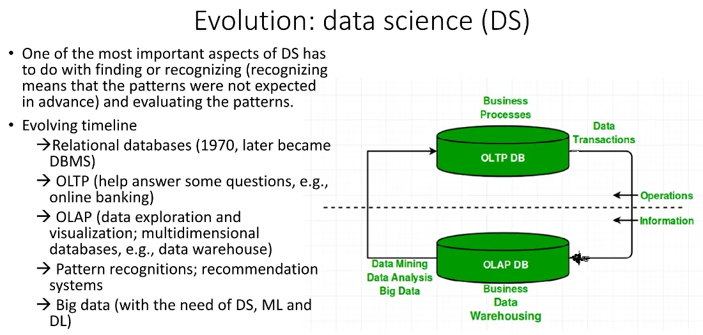

## 02 What EDA is

**Exploratory Data Analysis (EDA)** is a data analysis technique that helps you understand your data by summarizing its main characteristics, often using statistical graphics and other data visualization methods.

**EDA is a ==non-parametric== approach** — it makes no assumptions about the underlying distribution of the data.

The distinction the slide states outright:

- **A ==box plot== is an EDA chart**
- **==Linear regression== is not EDA** — it is a type of **data modeling**
- But EDA is used to identify patterns and trends in the data, which can then feed into building a linear regression model

EDA takes in **data visualization + ==statistical summaries== + hypothesis testing**.

*(from the transcript)* The main purpose is to understand the important characteristics of the data before analysing it further — looking at the car dataset to see what each feature is, what range of values it holds, whether there is much missing data, and whether all 26 columns will be used. Reading a table of text alone makes this hard, so you plot it. It is an **iterative process**, not something done once and finished, comparable to building a rough prototype in software work to check a few things before committing real effort.

### How many variables are analysed at once

| Term | Number of variables | Example |
|---|---|---|
| **Univariate** | 1 | A box plot (one axis only) |
| **Bivariate** | 2 | A scatter plot (x and y axes) |
| **Multivariate** | 3 or more | Predicting price from horsepower + engine size + brand |

## 03 Modeling / Data Modeling / Data Fitting / Model Fitting

These four are easily confused, and the slides separate them clearly.

### Modeling (the broadest)

Creating a **simplified representation** of a system or process, by any of several means: mathematical equations, computer simulations, or a physical model.

**Model fitting is an ==iterative== process**, because there are typically several modelling approaches applicable to a given task, and even within one approach there is a list of parameters you can set to obtain different configurations of the model.

*(from the transcript)* The examples given in class: modelling the direction and speed of a storm to work out which province it will reach and when, which needs sensor data (wind speed, humidity, air pressure); or a small model aeroplane in a wind tunnel before the real thing is built.

### Data Modeling

**Broader than ==data fitting==** — creating a **conceptual representation** of data, used to

- understand the data
- communicate the data to others
- build systems that use the data

It can take many forms: mathematical models, statistical models and conceptual models such as **ERD** (data entities and relationships), **DFD** and **UML** *(from the transcript: which is exactly what is taught in ==System Analysis and Design==)*.

### Data Fitting

Specifically focused on **finding the mathematical function that best describes the existing data**.

- Used to interpolate and extrapolate data points in a dataset
- Example techniques: **==least squares regression==, polynomial fitting, spline interpolation**

### Model Fitting

**Emphasis on the model itself** — adjusting the parameters of a pre-selected model (one that represents a theoretical relationship or hypothesis) so that it best explains or predicts the observed data.

- Used in statistics, machine learning and econometrics, with models such as linear regression, neural networks and decision trees
- **Focus on ==generalization==** — not just how well it fits the training data, but how well it works on new, unseen data
- Example techniques: **==gradient descent==, maximum likelihood estimation** and other optimization algorithms

*(from the transcript)* To sum up how they nest: **Modeling** is the broadest → inside it sits **Data modeling** → and below that come **Data fitting** and **Model fitting**, with data fitting forming a part of doing model fitting.

## 04 Model parameters and hyperparameters

| | Who sets it | Examples |
|---|---|---|
| **Model parameter** | **Estimated from the data automatically by the algorithm** | Weights, coefficients |
| **Model hyperparameter** | **Set manually by a person**, used in the process of estimating the parameters | k in KNN, learning rate, number of layers in a NN, number of epochs, loss function |

*(from the transcript)* Why weights can hold "knowledge" — for a straight line, all you need to store is the **slope** and the **y-intercept**. Once you have those two, you have the equation y = mx + c. Now picture a modern model with ==billions or trillions== of parameters. That is where the term **open weight model**, heard so often around generative AI, comes from.

As for the word **hyper**, it is there to mark these off from ordinary model parameters and to signal something that lies *beyond*, put in from the outside rather than arising from within.

## 05 Model bias — underfitting and overfitting

| | Meaning |
|---|---|
| **Underfitting** | The model is too simple to capture the underlying patterns in the data *(from the transcript: or there are too few data points, or too little training)* |
| **Overfitting** | The model is too complex and **learns the noise as well**, performing very well on the training data but poorly on new data |

*(from the transcript)* **Noise** is the part of the data that comes in unwanted and serves no purpose, but which the model goes and learns anyway — the fix for ==overfitting== is **validation** (to be covered later).

## 06 An overview of the ML methods used in DS

| Group | Kind of task | Methods |
|---|---|---|
| **Supervised Learning** | **Classification** (predictive) | Naïve Bayes, K-nearest neighbors (k-NN), Support vector machine (SVM), Decision trees, Random forest, Logistic regression |
| **Supervised Learning** | **Regression** (predictive) | **Linear regression** |
| **Unsupervised Learning** | **Clustering** (descriptive) | DBSCAN, **K-means**, BIRCH |
| **Unsupervised Learning** | **Association rules** (descriptive) | Apriori, e.g. market basket analysis |
| **Unsupervised Learning** | **Anomaly detection** / outlier detection (descriptive) | |
| — | **Visualization** (descriptive analytics) | Box plots, scatter plots and so on |
| **Reinforcement Learning** | Learning by trial and error | |

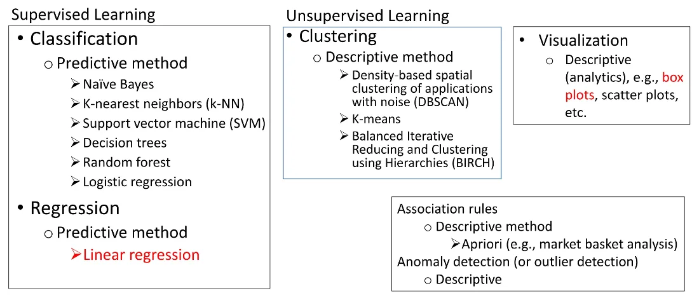

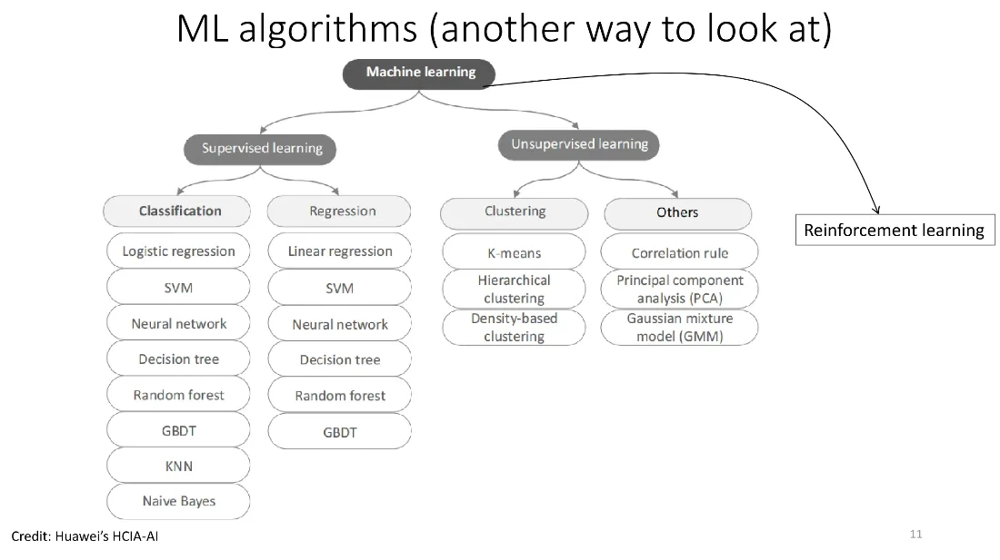

### Supervised vs unsupervised vs reinforcement *(from the transcript)*

- **Supervised** = learning ==with a teacher==, which means **labels** are supplied — telling the model that a flower with petals of roughly this width and length is species A. There has to be a y variable
- **Unsupervised** = no labels and no y variable; the model learns on its own, as in clustering. The simplest example is **k-means**, where k is the ==number of groups== (a ==hyperparameter==) and mean refers to the **centroid**, the centre point of each group. Compare it to letting a class of students form their own groups by whatever similarities they see, with nobody telling anyone which group to join
- In clustering **there is no fixed right or wrong** — three groups or four groups, neither is wrong; you only ask which is better
- **Reinforcement learning** = learning by trial and error, with a **reward** for doing well and a penalty for doing badly, plus feedback. The examples are playing chess or Go, or a robot learning to walk and avoid obstacles

### Generative AI mixes all three *(from the transcript)*

1. **==Unsupervised== pre-training** — vast amounts of data are collected, textbooks, articles and code from around the world, and used for training
2. **Supervised** — question-and-answer pairs are fed in for the model to learn from
3. **Reinforcement** — several models are run at once and given feedback on which answered better, with more points to the better one, and the model learns from that

### Predictive vs descriptive models

The models produced by the ==data mining== step fall into two types.

| Type | Goal |
|---|---|
| **Predictive model** | Predict the value of one variable given the rest — the variable to be predicted is the **dependent or target variable**, and the ones used for prediction are the **independent or predictor variables** |
| **Descriptive model** | Identify the relationships between variables in order to learn more about the structure of the data |

*(from the transcript)* A predictive example: this make of car, a sedan, this much horsepower, black — roughly what price? Or a condo on the twentieth floor in this district, this many square metres, what price? A descriptive model simply presents what it found.

## 07 Types of data and scales of measurement

### Types of variable

```
                   Variable
        ┌──────────────┴──────────────┐
   Categorical                    Numerical
  (Qualitative)                 (Quantitative)
    ┌────┴────┐                  ┌────┴────┐
 Nominal   Ordinal            Discrete  Continuous
```

| Type | Characteristics | Examples |
|---|---|---|
| **Discrete** | Distinct numbers with step-size values | Population, number of coins in a pocket |
| **Continuous** | Not limited by step size, nor by the number of decimal places (though usually rounded somewhere) | The amount of water in a cup, a real value from 0 to 1, weight, height |
| **Nominal** | Describes characteristics; numbers can be assigned but cannot be compared mathematically | Gender, race, city, product brand |
| **Ordinal** | A mix of numerical and categorical; comparable, but not straightforwardly, and you need many data points for the comparison to mean anything | Hotel star ratings of 1–5, education level, grades A B C D F |

*(from the transcript)* An interesting example: **the numbers on athletes' shirts**, such as 8, 10 or 23 — they are numbers, but they are only **symbols** and say nothing about who is better, so they are **nominal** rather than numerical. Seeing digits is not enough; you have to consider the purpose and the context of their use.

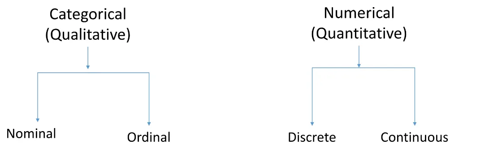

### Scales of measurement

Another way of looking at numeric data: through the lens of **measurement**.

| Scale | Property | Examples |
|---|---|---|
| **Nominal** | Identifies a category only | Blood type, zip/area code, gender, race, eye colour, political party |
| **Ordinal** | Has an order | Socio-economic status (low/middle/high income), education level (high school, BS, MS, PhD), satisfaction rating |
| **Interval** | **No true zero**; differences are meaningful, and equal differences mean equal distances | Temperature (°F, °C), pH, TOEFL score (310-677), standardized exam score, AD year, BE year |
| **Ratio** | **Has a true zero**, so ratios of "how many times" are meaningful | Dose amount, flow rate, concentration, pulse, weight, length, temperature in **Kelvin** (0.0 K = no heat at all = −273.15 °C) |

*(from the transcript)* How to remember it:

- **True zero** means that a value of zero really is **the complete absence of the quantity** — 0 kilograms is no weight, 0 baht is no money, ==0 Kelvin== is no thermal energy
- ==0 °C== is **not** a true zero, because thermal energy is still present; it is a number human beings agreed on
- The consequence: **50 °C is not twice as hot as 25 °C**, but **100 K is twice 50 K**, because they share a ==true zero== as their base
- AD and BE years have no true zero (they mark an agreed starting point) → the year 2000 is not "twice" the year 1000
- Standardized test scores like ==TOEFL== have no true zero, since even answering everything wrong still leaves you with a baseline score
- **Interval** is about **differences**: if the numeric difference is equal, the distance must be equal. pH 7.8 and 9.8 are 2 units apart, exactly as pH 0.9 and 2.9 are

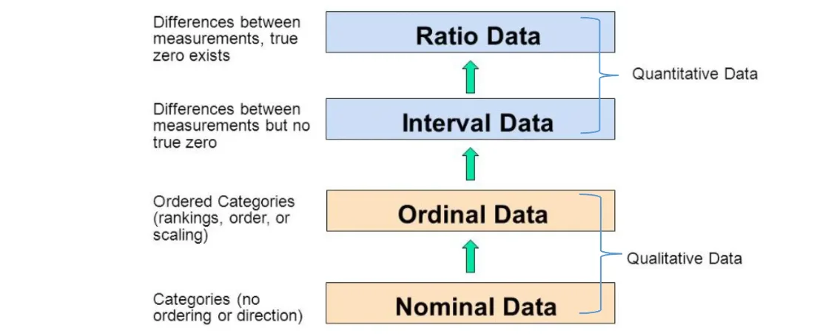

## 08 Distributions and the three measures of centre

### The three averages

| Measure | Meaning | Pros and cons | Example use |
|---|---|---|---|
| **Mean** | The typical average value we all know | Easy to understand, **takes every data point into account**, but **pulled by outliers** | Exam scores of a class, average time to drive home |
| **Median** | The middle value once the data is sorted | Doesn't tell you much about the rest of the data | Household income of a country |
| **Mode** | The most common value = **the peak of a histogram** | Doesn't tell you much about the rest of the data | Employees' income in a company |

The slide stresses that **there is no single best measure, but using ==just one== is a bad idea**.

### The shape of a distribution *(from the transcript)*

- **Normal distribution** — symmetric, the same on the left and the right, shaped like an upturned **bell**. In this case mean, median and mode all land on the ==same point==
- The y axis of a histogram is **frequency**, the number of occurrences, so the peak is **always the ==mode==**
- **Skew** — if there are **extreme** values to the right, the values are dragged right, which is **positive skew**; dragged left is **negative skew**
- **The mean is always pulled towards the ==tail==**, while the median sits between the mode and the mean
- Examples of the pull: most people stand around 1.7–1.8 metres, so a few people over 2 metres drag the average to the right; a few very high earners drag the average income of the whole group up

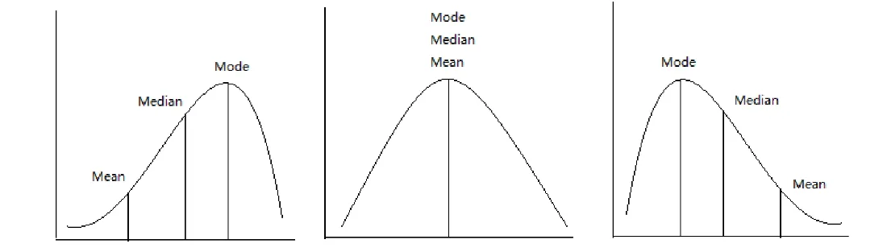

### Statistical summary and aggregate data

Summary statistics such as min, max, mean, median and mode — *(from the transcript)* sometimes called **aggregate data**, because they are values that have been gathered and processed (finding a mean means summing first, then dividing by the count).

## 09 Box plots (box and whisker plots)

What a box plot tells you

- The **dispersion** (also called variability, scatter or spread) of the data
- The **skewness**, if any
- The **quartiles**
- The **outliers**, if any
- It can be used **to compare between groups**

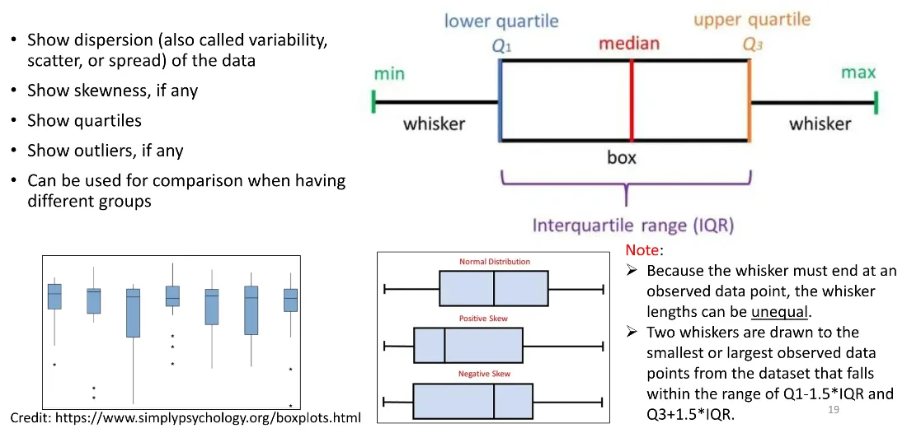

### The five-number summary

| Symbol | Meaning |
|---|---|
| min | The smallest value lying inside the fence |
| **Q1** | The 25th percentile |
| **Q2** | The 50th percentile = **the median** |
| **Q3** | The 75th percentile |
| max | The largest value lying inside the fence |

*(from the transcript)* Q stands for ==quartile== — once you know these ==five values== you can draw the box.

### IQR and the fences

```
IQR         = Q3 − Q1                  ← the length of the box
lower fence = Q1 − 1.5 × IQR
upper fence = Q3 + 1.5 × IQR
```

- The **whisker** must always end at an **observed data point** — it runs to the point furthest from the box that is still **inside the fence**, not out to the fence itself. So **the two whiskers need not be the ==same length==**
- **Any point outside the fence is an ==outlier==**, and the min/max counted for the box exclude outliers
- **==Q2== is inside the box but need not be in the middle**, because the data may be skewed left or right
- Each section of a box plot holds **25%** of the data (four sections in all)
- Drawing it vertically or horizontally makes no difference; it is only a change of viewpoint
- The ==1.5== in Orange is a **default that can be adjusted**

*(from the transcript)* How to handle outliers: you may discard them, **but you have to find the reason they are extreme**. You might analyse the extreme group separately from everyone else, because if you don't, the overall picture is spoiled — if two or three classmates are over 2 metres tall, analyse them apart.

**The advantage over a histogram** *(from the transcript)* — you see the distribution without plotting the whole thing, and you can **compare several groups side by side at once**.

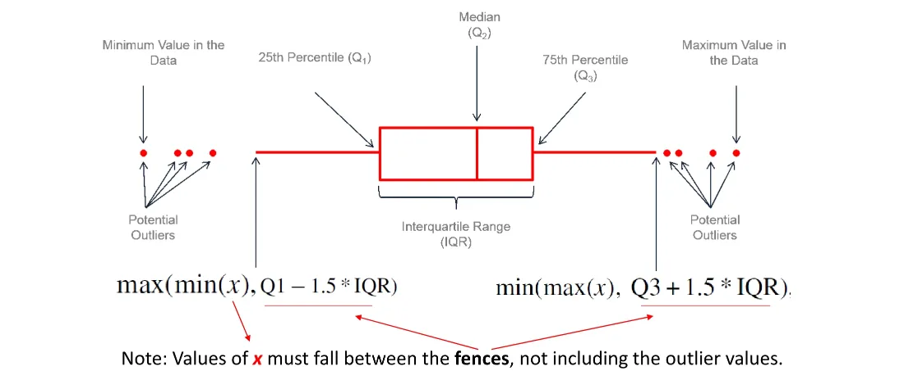

### An example in Orange: Iris

Plotting a box plot of petal width split by species (setosa / versicolor / virginica) makes it obvious that **the three species differ clearly**, so this feature can be used to classify the species — a demonstration of doing EDA before moving on to the next stage of analysis.

## 10 Scatter plots and correlation

### Scatter plot

- Shows **every data point**
- Shows **how dense or sparse** the data is
- Shows **correlation** and **trend**, if any

*(from the transcript)* The word scatter means spread about, like scattering seed — a trend is a direction, up or down, such as bigger cars costing more.

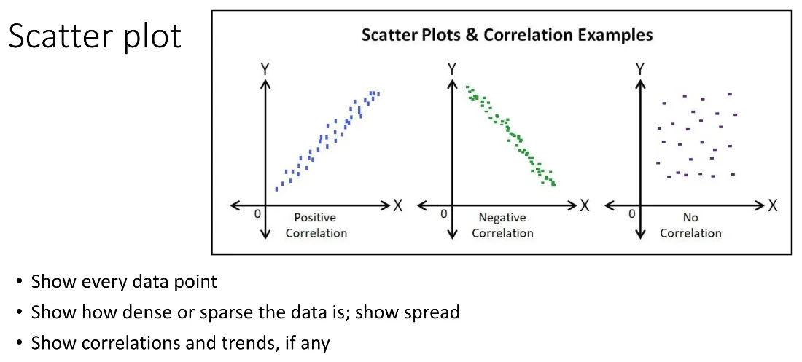

### Correlation

```
-1 ≤ r ≤ 1
```

| Value of r | Meaning |
|---|---|
| **+1** | A perfect positive relationship; the points line up going upward |
| **0** | No relationship; the points are spread everywhere |
| **−1** | A perfect negative relationship; the points line up going downward |

| Method | Used with | Condition |
|---|---|---|
| **Pearson correlation** | **Numerical** data | Only for **linear** relationships |
| **Spearman correlation** | **Ordinal scale** (ranked order) data | Monotonic or linear relationships |

*(from the transcript)* The formula rests on subtracting each value from the mean of its own axis (x̄, ȳ) and multiplying — **the numerator may be positive or negative, but the denominator has a ==square root== and is therefore always positive**, which is why the result lands between ==−1 and 1==. The lecturer said there is no need to memorise the formula.

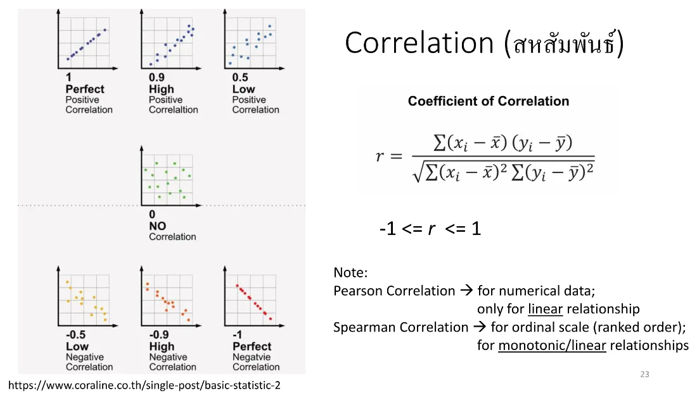

## 11 Linear regression

### The question linear modeling answers

**“Does x influence y?”** For instance:

- Are house prices influenced by incomes?
- Is changing a car's oil more frequently a good thing — does it save money in the long run?

> ⚠️ The classic statisticians' warning quoted on the slide: **“Correlation does not mean causation.”**

### Conditions on the variables

- **The target variable must always be ==numerical==**, e.g. inches of rain for the day, or the price of a car
- **The predictor variables may be ==numerical, categorical or ordinal==**
- If the target is categorical (a weather forecast of sunny/cloudy/rain/snow), threshold values can still be used (==quantization==) to classify, but in general **logistic regression** (which is based on probability) is more suitable

### The equation

The linear model is `y = f(X, w)`, where x is the predictor, y is the target, f() is a linear function and w is the parameter set.

**Simple linear regression** — one predictor variable

```
y = w₀ + w₁x + ε
```

where w₀ is the ==intercept==, w₁ the ==slope==, and ε the error or residual.

*(from the transcript)* The word **linear** means the degree (the exponent) is only **0 or 1**. From degree 2 upwards it is called a **polynomial** (degree 2 is ==quadratic==, degree 3 is cubic), for instance `w₀ + w₁x₁ + w₂x₂² + w₃x₃³ + …` — this course uses only the linear form.

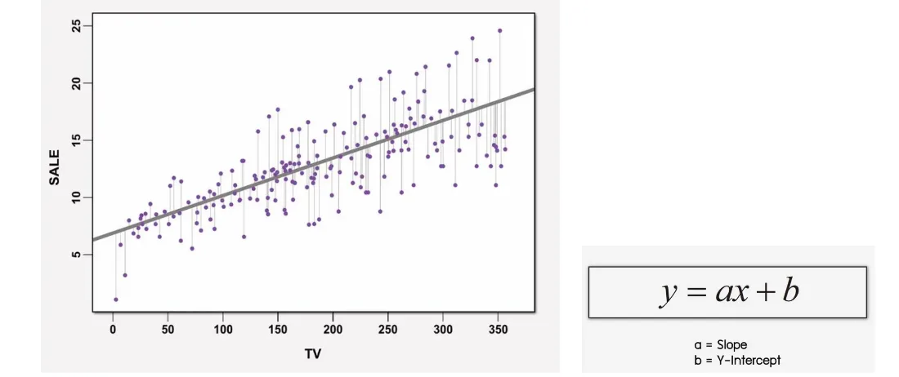

### Why it is called "regression" *(from the transcript)*

There are a million lines that could be drawn through the data, and the algorithm asks of each in turn whether it is good enough, then picks the single line with **the smallest error**. The "regression" here is that **the error regresses, falling step by step**, until the best line is found.

### The loss function and finding w

- **Error** is defined as **the distance between a data point and the line**, squared, then summed over every point
- The most popular loss function (cost function) for regression is the **==least squares== method**
- How the best w is found: **take the ==derivative== of the loss function, set it to zero, and solve**
- The target function is called the **cost function** or objective function, with the goal of **minimizing** it — the answer is the **argmin**, the argument that returns the minimum value from the target function

*(from the transcript)* This is the same principle deep learning and machine learning use — find the smallest error to get the best weights. The only difference is that we have two weights while generative AI has millions upon millions.

### The two steps of using a model

| Step | What happens |
|---|---|
| **Model Fitting** | For a dataset with variables x₁…x_m and y, calculate the model parameters **w** that best meet the chosen criteria |
| **Model Prediction** | Given the predictor variables x₁…x_m and the parameters w, calculate the value of **y** |

### Simple vs multiple

| | Number of predictors |
|---|---|
| **Simple linear regression** | 1 |
| **Multivariate / multiple linear regression** | More than 1 |

Multiple linear regression looks at how several predictors affect the target, letting you **observe the effect of changing one predictor while holding the others fixed**.

*(from the transcript)* You can keep adding predictors, **but too many is not a good thing** — around ==four or five== it starts getting unwieldy. Two or three is usually enough to see a relationship that actually holds up.

## 12 Reading the model output

The output of `lm()` in R (lm = **l**inear **m**odel) has several things worth reading properly.

### Coefficients

Each line is the **weight** of that variable, with the `(Intercept)` line being **w₀**.

### The stars (significance codes) — from the t-test

| Stars | p-value level |
|---|---|
| `***` | 0.001 (0.1%) |
| `**` | 0.01 (1%) |
| `*` | 0.05 (5%) |

- A **t-test** tells you whether **a single variable** on its own is statistically significant
- An **F-test** tells you whether **a group of variables jointly** is significant (the larger the better), and the **p-value** is read alongside it for the big picture
- The rule of thumb: a `Pr(>|t|)` or p-value **below ==0.05==** counts as statistically significant

*(from the transcript)* The smaller the error the better — ==three stars== is best, and anything from one star up is usable. No stars at all means the variable predicts poorly and need not be used. For work that is not a matter of life and death, a 5% error is acceptable.

### R, R² and adjusted R²

| Value | Meaning |
|---|---|
| **R** | The correlation |
| **R²** | The **coefficient of determination (CD)** — how well the terms fit a line or curve, from 0 to 1. A value of 1.0 would mean the X variables as a set predict Y perfectly |
| **Adjusted R²** | Penalises adding variables carelessly — **add a useless variable and adjusted R² falls, add a useful one and it rises**, and **adjusted R² is always ≤ R²** |

*(from the transcript)* The rough thresholds the lecturer gave: **R² of ==0.6== upwards is good** (0.5 will do), while R should be above ==0.8== (0.8² ≈ 0.64). The reason adjusted R² is needed is that **R tends to rise simply from adding more predictors**, so a high value can be manufactured artificially. When comparing models of differing complexity, rely on adjusted R².

## 13 Categorical variables in the equation

An example from the slides (multivariate, all numeric):

```
Price = 58.35 × Horsepower + 110.13 × Length + 101.45 × EngineSize − 24,836.65
```

An example including a categorical variable (the car's brand) — the slide's case is BMW:

```
Price = 64.38 × Horsepower + 57.07 × EngineSize + 1.0 × 8,062.71 − 408.06
```

**The rule** — use only one brand per prediction, **multiplying ==1.0== by the coefficient of the chosen brand and ==0.0== by every other brand** (multiplying by 0 simply means leaving it out).

The example code in `LinearReg_auto.R` applies the same rule to Porsche and Mitsubishi:

```r
# Porsche: hp=150, es=100, bd="porsche", intercept = -408.062
pred_price = 64.381*150 + 57.068*100 + 1.0*9054.119 - 408.062

# Mitsubishi: hp=150, es=100, bd="mitsubishi"
pred_price = 64.381*150 + 57.068*100 + 1.0*(-3804.304) - 408.062
```

*(from the transcript)* Once again, **y must always be ==numeric==**, whether simple or multiple. The x side can mix numbers (horsepower) with categories (brand, which is **nominal** rather than ordinal, since no brand ranks above another). Looking at the output you will see some brands earning three stars and others no stars at all (typically those with little data), meaning that brand predicts poorly.

## 14 Hands-on: R and RStudio

Install **R (the compiler/interpreter)** first, then **RStudio**, and set the **working directory** to wherever the files are kept. In RStudio, putting the cursor on a line and hitting Run executes one statement at a time, or you can select several lines and run them together.

All the code is in `../code/LinearReg_auto.R` and the data in `../code/imports-85.data`.

### Reading the data and inspecting its structure

```r
# this dataset has no header, and some systems convert char to factors automatically, so switch that off
auto <- read.csv("data/imports-85.data", header = FALSE, stringsAsFactors = FALSE)

dim(auto)     # number of rows and columns → 205 x 26
str(auto)     # the structure: what type each column is
names(auto)   # column names (V1, V2, ... by default)
```

### Naming the columns

```r
# rename every column at once with c() (combine)
names(auto) <- c("symbol","nloss","make","fuel","aspiration",
                 "doors","body","wheels","engineloc","wheelbase",
                 "length","width","height","weight","enginetype",
                 "cylinders","enginesize","fuelsys","bore",
                 "stroke","compressratio","horsepower","rpm",
                 "citympg","hwmpg","price")

# or rename them one at a time by index
names(auto)[22] <- "Horsepower"
names(auto)[26] <- "Price"
names(auto)[3]  <- "Brand"
names(auto)[7]  <- "BodyStyle"
names(auto)[17] <- "EngineSize"
```

### Handling missing data

```r
# in this dataset missing values are represented by '?'
which(auto$Horsepower == '?')
which(auto$Price == '?')

sort(auto$Horsepower)   # not quite sorted, because it is still character

# convert to number — '?' is coerced to NA
auto$Horsepower <- as.numeric(auto$Horsepower)
sort(auto$Horsepower, decreasing = TRUE)   # NA is not shown
which(is.na(auto$Horsepower))              # find the index of the NAs

auto <- na.omit(auto)   # drop the rows holding NA
```

*(from the transcript)* **An important observation** — while `Horsepower` is still a string, `sort()` orders it ==alphabetically==, so `"100"` comes before `"62"`. You have to convert it to a number for the sort to be right. And `$` is how you reach a column in a data frame (`data_frame_name$column_name`).

### Basic statistics

```r
min(auto$Horsepower, na.rm = TRUE)     # na.rm = TRUE means ignore the NAs
max(auto$Horsepower, na.rm = TRUE)
range(auto$Horsepower, na.rm = TRUE)
mean(auto$Horsepower, na.rm = TRUE)
median(auto$Horsepower, na.rm = TRUE)

summary(auto$Horsepower)   # min, Q1, median, mean, Q3 and max in one call

# R has no built-in mode function — use a frequency table instead
table(auto$Horsepower)
sort(table(auto$Horsepower))
```

*(from the transcript)* `summary()` gives the five values a box plot uses **plus the mean**, but it is not a box plot. `table()` reveals the **mode** — in class it showed that **68 horsepower occurs most often, ==19 times==**, while 48 horsepower has only a single value.

### Visualization

```r
# Histogram
hist(auto$Horsepower, col = "lightgray")
hist(auto$Horsepower, xlab = "Horsepower", breaks = seq(0,300,10),
     col = "yellow", main = "Histogram of horsepower (205 cars)")

# Box plot, vertical then horizontal
boxplot(auto$Horsepower, main = "205 Cars from the 1985 Automobile Dataset",
        ylab = "Horsepower", col = "orange")
boxplot(auto$Horsepower, horizontal = TRUE, xlab = "Horsepower", col = "lightyellow")

# Box plot split by subgroup — note the ~
boxplot(auto$Horsepower ~ auto$BodyStyle, col = "lightgreen",
        ylab = "HP", xlab = "Body Style", main = "Horsepower vs. Body Styles")

# add the mean of each group onto the box plot
means <- tapply(auto$Horsepower, auto$BodyStyle, mean)
points(means, pch = 19, cex = 1.2, col = 'red')   # pch = plot character, cex = scale

# Scatter plot
plot(auto$Horsepower, auto$Price, xlab = "Horsepower", ylab = "Price ($)",
     main = "205 Cars from the 1985 Ward's Automotive Yearbook", col = "blue")
```

*(from the transcript)* The box plot of horsepower shows **==four== outliers** at the extreme, and splitting the box plot by body style allows an immediate comparison of the subgroups — wagon looks fairly normal, while convertible and hardtop look off (Q1 and Q2 sit very close together). The default histogram may not look good; adjust `breaks` to control the size of each **bin**, which counts how many values fall into that range.

### Pairs plot — several pairs at once

```r
pairs(data = auto, ~ auto$Price + auto$Horsepower + auto$EngineSize,
      col = "blue", main = "Automobile dataset")

# a version with a regression line added to every pair
panel.lm <- function(x, y){
  points(x, y, col = "blue")
  abline(lm(y ~ x), col = 'red')
}
pairs(data = auto, ~ Price + Horsepower + EngineSize + height + citympg,
      panel = panel.lm, main = "Pairs function of some chosen variables")
```

*(from the transcript)* **When reading a pairs plot, check carefully which axis is which**, because the panel opposite has ==x and y swapped==. The advantage is seeing the relationship of every pair at once.

### Simple linear regression

```r
modelAuto <- lm(auto$Price ~ auto$Horsepower)   # the form is lm(Y ~ X)
coef(modelAuto)        # the coefficients
summary(modelAuto)     # the full output, with t-tests, R² and adjusted R²

# Pearson correlation, ignoring the NAs
cr <- cor(auto$Horsepower, auto$Price, method = "pearson", use = "complete.obs")
cat("Correlation =", cr)

# add the regression line onto the scatter plot drawn earlier
abline(modelAuto, col = "red")
```

**The result obtained in class** — the equation the lecturer wrote out was

```
Price = -4562.175 + 172.206 × Horsepower
```

(Confirmed by recomputing it from `imports-85.data` directly: across the 199 rows holding both horsepower and price, the intercept is −4562.175 and the slope 172.206, with **r = 0.8105** and **R² = ==0.657==**, matching the r = 0.81 Orange displayed in last week's session.)

### Prediction

```r
# name the variables and rebuild the model
pr <- auto$Price
hp <- auto$Horsepower
modelPr <- lm(pr ~ hp)

# the data frame of test values must use the SAME variable name used in training
predData <- data.frame(hp = c(0, 200, 100, 250))
predict(modelPr, predData)
```

### Multiple linear regression

```r
multivModel <- lm(auto$Price ~ auto$Horsepower + auto$EngineSize)
coef(multivModel)
summary(multivModel)

# several plots in one figure
par(mfrow = c(1,2))   # c(nrows, ncolumns)
# ... plot ...
par(mfrow = c(1,1))   # reset
```

### Adding a categorical variable

```r
# the character column has to become one of R's factors first
auto$Brand <- as.factor(auto$Brand)
str(auto)   # check that it changed

multivModel <- lm(auto$Price ~ auto$Horsepower + auto$EngineSize + auto$Brand)
summary(multivModel)

# predicting by passing the categorical value straight in
pr <- auto$Price; hp <- auto$Horsepower
es <- auto$EngineSize; bd <- auto$Brand
modelPr <- lm(pr ~ hp + es + bd)

predData <- data.frame(hp = c(150,150), es = c(100,100),
                       bd = c("porsche","mitsubishi"))
predict(modelPr, predData)
```

## 15 Comparing the results against Orange

In class the Orange workspace `Linear Regression (Imports-1985 dataset).ows` was opened to build the same model (target = price, features = horsepower + brand + body style) and its coefficients compared with the ones R produced.

**They come out close but not identical** — the coefficient for horsepower was around 105 in Orange against 109.64 in R. The lecturer put this down to **the two pieces of software having different defaults for ==preprocessing and scaling==**. The conclusion: **Orange can be used to check R's results**.

*(The figures in this section were transcribed from a poor-quality recording and may be inaccurate — trust whatever you get running it on your own machine.)*

In Orange you must run **Edit Domain** to name the columns first, then **Select Columns** to pick features and target — note that **Orange's index starts at ==x0== while R's starts at ==V1==**, so the same column is 25 in Orange but 26 in R.

## 16 The work that was set

### Exercise 2 — multiple linear regression on imports-85

| Item | Detail |
|---|---|
| Do it in | **Both R (RStudio) and Orange**, and compare the results |
| Dataset | `imports-85` (Automobile), the same one used in class |
| Target (y) | **Price** |
| Predictors (x) | **Three** — Horsepower, BodyStyle, Brand (make) |
| What to submit | **The equation and the coefficients** at minimum, screen captures of the important code, and the prediction results |
| Test cases | Make up two or three of your own, e.g. Brand = Honda, BodyStyle = sedan, a given horsepower, then **substitute into the equation by hand** and compare against `predict()` |
| File format | Capture the images → paste into Word → **save as PDF** |
| Working together | Talking with friends and sharing is allowed (not everyone brought a computer), but **each person submits their own file** |
| Marks | It **counts towards the coursework mark** |
| Deadline | **18.00 the same day (Wednesday 19 Aug)** — anyone who has to go home to do it may take until midnight *(this deadline is Group 1's — Group 2 must confirm it in their own session)* |

*(from the transcript)* The lecturer said there is no need to submit plots, since a categorical variable like body style cannot be plotted directly (it goes beyond ==two dimensions==) — **the equation and the coefficients** are what he wants. If you are unsure how to do the prediction, look at the example in the decision tree file he sent, search YouTube, or ask an AI.

### The to-do left inside the code file

The end of `LinearReg_auto.R` carries a matching exercise:

> Use this Automobile dataset and try to work out on finding some more useful correlation, boxplots, and linear regression, using one more additional variable, which is: **body-style** (hardtop, wagon, sedan, hatchback, convertible)

### The assignment written on the final slide

Slide 40 sets out a separate task (not assigned as homework in this session).

> Work on the **smartwatch's heart rate dataset** provided in class (or pick any publicly available dataset), then produce box plots, histograms (or distributions) and scatter plots, perform linear regression (intercept and coefficient values), and find the correlation (r), R-squared and adjusted R-squared values

### Project idea presentation — next week (week 4)

**3–4 minutes** per team over about **3 slides**, covering what you will do, where the data comes from and what you expect to get. **Asst. Prof. Dr. Chakarida** will sit in and give comments. Teams of 4–5 (4 recommended).

## Glossary

| Term | Short definition |
|---|---|
| OLTP | Online Transaction Processing, handling transactions that occur frequently and fast, as in banking or a convenience store |
| OLAP | Online Analytical Processing, exploring and analysing historical data from a multidimensional warehouse |
| EDA | Exploratory Data Analysis, summarising the main characteristics of data with graphics and statistics; a non-parametric approach |
| Univariate | Analysis using a single variable, such as a box plot |
| Bivariate | Analysis using two variables, such as a scatter plot |
| Multivariate | Analysis using three or more variables |
| Modeling | Creating a simplified representation of a system or process; the broadest term in this group |
| Data modeling | Creating a conceptual representation of data, such as an ERD, DFD or UML diagram |
| Data fitting | Finding the mathematical function that best describes existing data, e.g. least squares or polynomial fitting |
| Model fitting | Adjusting the parameters of a chosen model to explain or predict the data best, with the emphasis on generalization |
| Model parameter | A value the algorithm estimates from the data itself, such as a weight or coefficient |
| Hyperparameter | A value a person sets before training, such as k in KNN, the learning rate, the layer count or the epoch count |
| Underfitting | A model too simple to capture the real patterns |
| Overfitting | A model so complex it learns the noise, doing well on training data but badly on new data |
| Noise | The part of the data that arrives unwanted and serves no purpose |
| Supervised learning | Learning with a teacher, meaning labels or a y variable are supplied |
| Unsupervised learning | Learning without a teacher, with no labels and no y variable, as in clustering |
| Reinforcement learning | Learning by trial and error, with rewards and penalties acting as feedback |
| Centroid | The centre point of each group when doing k-means |
| Predictive model | A model that predicts the value of the target variable from the predictor variables |
| Descriptive model | A model that identifies relationships between variables to reveal the structure of the data |
| Nominal | Categorical data naming a type only, with no order, such as gender or brand |
| Ordinal | Categorical data carrying an order, such as star ratings or grades |
| Interval | A scale where differences are meaningful but there is no true zero, such as Celsius, the AD year or pH |
| Ratio | A scale with a true zero, so ratios are meaningful, such as weight, height or Kelvin |
| True zero | The point where zero means the quantity is genuinely absent; the test that separates ratio from interval |
| Mean | The average across every data point, and therefore easily pulled by outliers |
| Median | The middle value once sorted, equal to Q2 or the 50th percentile |
| Mode | The most common value, corresponding to the peak of a histogram |
| Skewness | How lopsided a distribution is; leaning right is positive skew, leaning left is negative skew |
| Box plot | A chart showing spread, skew, quartiles and outliers from five values |
| Quartile | The values splitting the data into four equal parts, namely Q1, Q2 and Q3 |
| IQR | Interquartile Range, Q3 minus Q1, which is the length of the box |
| Fence | The bounds computed as Q1 minus 1.5 times IQR and Q3 plus 1.5 times IQR |
| Whisker | The line of a box plot running to the furthest real data point still inside the fence |
| Outlier | A data point outside the fence, treated as an extreme value and usually excluded |
| Scatter plot | A plot of every data point, revealing density, correlation and trend |
| Correlation | The relationship between two variables, ranging from minus one to one |
| Pearson correlation | The correlation method for numeric data and linear relationships only |
| Spearman correlation | The correlation method for ordinal data and monotonic relationships |
| Linear regression | Fitting the straight line that best represents the relationship between predictor and target |
| Least squares | Finding the best line by minimising the sum of the squared distances |
| Residual | The discrepancy between the actual value and the one the model predicts |
| Intercept | Where the line crosses the y axis, the w zero term of the equation |
| Coefficient | The weight multiplying each predictor variable |
| Simple linear regression | Linear regression using a single predictor variable |
| Multiple linear regression | Linear regression using more than one predictor variable |
| Polynomial | An equation of degree two or higher, unlike linear which is only degree zero and one |
| Cost function | The objective function set up to be minimised, whose answer is the argmin |
| t-test | A test of whether one individual variable is statistically significant |
| F-test | A test of whether a group of variables is jointly significant; larger is better |
| p-value | The value that, below 0.05, marks a result as statistically significant |
| R-squared | The coefficient of determination, showing how well the data fits the line, from 0 to 1 |
| Adjusted R-squared | R-squared penalised for adding useless variables, always less than or equal to R-squared |
| lm() | R's function for building a linear model, written in the form lm(Y ~ X) |
| NA | The value R uses for missing data, short for not available |

## Chapter summary

| Point | What to remember |
|---|---|
| The DS timeline | Relational DB (1970) → OLTP → OLAP → pattern recognition → big data |
| What EDA is | Non-parametric initial exploration through visualization, statistical summary and hypothesis testing, done iteratively |
| The trap that could show up in an exam | **A box plot is EDA, but linear regression is not** — it is data modeling |
| How the terms nest | Modeling is broadest → Data modeling → and inside that, Data fitting and Model fitting |
| Parameter vs hyperparameter | Parameters the algorithm finds itself (weights); hyperparameters a person sets (k, learning rate, layer count) |
| Model bias | Underfitting is too simple, overfitting is so complex it learns noise; validation is the fix |
| Types of data | Categorical (nominal, ordinal) and Numerical (discrete, continuous) — an athlete's shirt number is nominal |
| Scales of measurement | Remember the true-zero test: ratio has one (weight, Kelvin), interval does not (°C, AD year, pH) |
| The measures of centre | The mean is pulled by outliers, the median is Q2, the mode is the peak of a histogram — never use just one |
| Box plot | Remember the five values (min, Q1, Q2, Q3, max), IQR = Q3 − Q1, fences at ±1.5 × IQR, whiskers ending on real data points, and anything outside the fence being an outlier |
| Correlation | −1 ≤ r ≤ 1 — Pearson for numeric and linear, Spearman for ordinal |
| Regression | Choose the line with the smallest total squared error, via least squares — and “correlation does not mean causation” |
| The constraint on variables | **y must always be numeric**, while x may mix numeric and categorical |
| Categorical variables | Multiply 1.0 by the coefficient of the value you chose and 0.0 by all the rest |
| Reading the output | Stars come from the t-test (more is better, p < 0.05 counts as significant), R² of 0.6 upwards is good, and comparing models of different complexity requires adjusted R² |
| The result from class | Price = −4562.175 + 172.206 × Horsepower, with r = 0.81 |
| The R commands to remember | `read.csv`, `dim`, `str`, `names`, `as.numeric`, `is.na`, `na.omit`, `summary`, `table`, `hist`, `boxplot`, `plot`, `abline`, `pairs`, `lm`, `coef`, `cor`, `predict` |
| What has to be handed in | Exercise 2 — multiple regression (y = price, x = horsepower + body style + brand) done in both R and Orange, submitted as a PDF |
