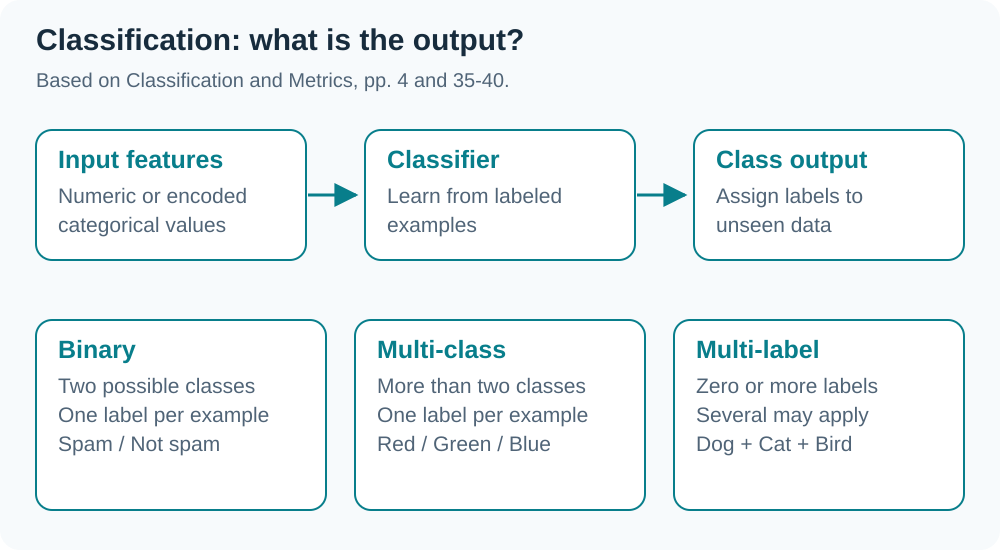
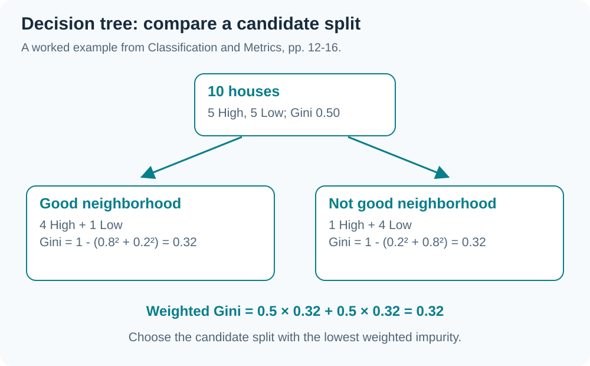

> Based on `Classification and Metrics.pdf` (71 pages) and the G2 lecture transcript dated 18 September 2026. This deck covers classifiers and metrics; this chapter emphasizes models and data splitting, with deeper evaluation in W07. Additions from the recording are marked *(from the transcript)*; technical names in the automatic transcript are sometimes distorted.

## 01 Overview: what is predicted?

Classification learns from features and known ==class labels== to predict a class for a new example. Regression instead has a numeric target, such as a house price (slides 4, 35).

| Type | Output per example | Example |
|---|---|---|
| Binary | One of two classes | Spam / Not spam |
| Multi-class | One of more than two classes | Flower species |
| Multi-label | Zero or several labels together | A picture containing a dog, cat, and bird |

*(From the transcript)* The lecturer compares multi-class prediction with a multiple-choice question requiring one answer. Multi-label prediction can assign several answers.

## 02 k-Nearest Neighbors

==k-NN== stores training examples and finds the k examples nearest to a query. Classification uses their majority label; regression uses their average target (slides 5, 58–67).

1. Choose k.
2. Compute distances from the query to training examples.
3. Sort distances and select the k nearest examples.
4. Combine labels by majority vote.

It is **nonparametric** and uses **lazy learning**: no compact fitted equation summarizes the data beforehand. Most work happens during prediction. Its simple idea is an advantage; expensive queries and sensitivity to k, scale, and dimension are limitations. See W09 for a visual comparison of k values.

## 03 Distances and data types

Slides 62–65 distinguish numeric and categorical distances:

| Distance | Idea |
|---|---|
| Euclidean | `sqrt(sum((x_j - z_j)^2))`, straight-line distance |
| Manhattan / L1 | `sum(abs(x_j - z_j))`, summed axis distances |
| Minkowski | General form; p = 1 gives Manhattan, p = 2 gives Euclidean |
| Hamming | Count categorical feature positions with different values |

Normalize when feature scales dominate distance. Both Euclidean and Manhattan distances depend on scale; choosing Manhattan does not itself remove a units problem.

## 04 Decision Trees and Gini impurity

A Decision Tree splits examples using feature questions until a leaf supplies the answer. It supports classification and regression. This week adds ==Gini impurity== to the Entropy/Information Gain approach in W05 (slides 9–17).

`Gini = 1 - sum(p_i^2)`

Gini = 0 means a pure group. For binary classification the maximum is 0.5, with equally frequent classes. Choose the candidate split with the **lowest weighted Gini**.

For 5 High and 5 Low houses, initial Gini is 0.5. Splitting by Neighborhood produces groups with ratios 4:1 and 1:4; each has Gini = 0.32, so weighted Gini is 0.32. This evaluates one candidate split; other features must still be compared before calling it the best split.

## 05 Naïve Bayes

==Naïve Bayes== estimates class probability given features, assuming features are independent **conditional on the class** (slides 18–26).

`P(c | x) = P(x | c) × P(c) / P(x)`

- `P(c)` is the class prior.
- `P(x | c)` is the feature likelihood within that class.
- `P(c | x)` is the posterior after observing features.

For the same x, the denominator `P(x)` is shared across classes, so compare `P(x | c) × P(c)`. The spam example gives `0.1 × 0.2 × 0.2 × 0.3 × 0.4 = 0.00048` as the Spam score for “Dear friend free money”. Compare it with the Ham score before choosing a class. It is not yet a normalized posterior probability.

Advantages include simplicity and fast training; the independence assumption may not match real data.

## 06 Logistic Regression

Despite its name, this model performs classification by mapping a linear score into 0–1 using the ==sigmoid== function (slides 27–31).

`p = 1 / (1 + exp(-(β0 + β1 x1 + ...)))`

Compare p with a threshold to choose a class. Slides use 0.5 as an example; a rule is also needed for equality at the threshold. Encode categorical features numerically, for example with one-hot encoding.

The slide asks whether a customer spending 3.5 minutes on a website will click Buy. Learned β coefficients are needed before computing a probability; time on the site alone does not determine the numeric answer.

## 07 Support Vector Machines

==SVM== seeks a separating hyperplane with a wide margin. **Support vectors** are nearby data points that influence the boundary (slides 32–34).

- A two-dimensional boundary is a line; higher-dimensional data use a hyperplane.
- For data not linearly separable in the original representation, the **kernel trick** handles more complex relationships.
- Results depend on the kernel and settings; large datasets can be computationally expensive.

*(From the transcript)* The lecturer uses posture recognition from joint positions to connect real-world features with classification.

## 08 Reduce multiple classes to binary problems

Slides 36–38 combine binary classifiers for C classes:

| Method | Classifiers | Example with four colors |
|---|---|---|
| One-vs-Rest (OvR) | C | Red vs other colors, Green vs others, etc.: 4 models |
| One-vs-One (OvO) | C(C−1)/2 | Compare every pair of colors: 6 models |

OvR separates each class from the rest. OvO separates each pair of classes, then combines predictions to obtain a multi-class output.

## 09 Training, validation, and final testing

Slides 41–45 separate data roles to measure ==generalization==: performance on unseen data.

| Dataset | Role |
|---|---|
| Training | Fit model parameters |
| Validation / Dev | Compare models and choose hyperparameters |
| Test | Evaluate the final model after all choices are made |

Splits such as 70:10:20 or 80:20 are examples, not mandatory ratios. *(From the transcript)* Very large datasets may need a smaller test percentage.

For **5-fold CV**, first reserve 20% for testing. Divide the remaining 80% into five folds. Train on four and validate on one, rotating through all folds. Use average validation performance to choose hyperparameters, refit on the entire 80%, then evaluate on the reserved 20%.

Underfitting has high training and test errors; overfitting has low training error but high test error. Multiple folds support model selection, while the final test must remain reserved.

## 10 Start reading a confusion matrix

Slides 46–57 introduce TP, TN, FP, FN, Accuracy, Precision, Recall, F1, Specificity, ROC, and AUC. **Define the positive class first**, and check which axis is actual versus predicted.

*(From the transcript)* In the fishing analogy, precision asks how much of the catch is the desired fish; recall asks how much of all the desired fish in the pond was caught. W07 provides formulas, calculations, and guidance on metric choice.

## Glossary

| Term | Meaning |
|---|---|
| Class label | Categorical target used to train a classifier |
| k-NN | Predict from the k nearest stored examples |
| Gini impurity | Class mixture measure: 1 − sum(p_i²) |
| Naïve Bayes | Probabilistic classifier assuming conditional independence |
| Sigmoid | S-shaped function mapping scores into 0–1 |
| Support vector | Point near the separating boundary that influences the SVM hyperplane |
| OvR | One class versus all remaining classes |
| OvO | Pairwise classification across all class pairs |
| Validation set | Data for choosing models or hyperparameters |
| Generalization | Ability to predict unseen examples |

## Chapter summary

| Topic | Key idea |
|---|---|
| Classification | Categorical targets; distinguish binary, multi-class, and multi-label |
| Classifiers | k-NN, Decision Tree, Naïve Bayes, Logistic Regression, SVM |
| Gini | Compare weighted impurity across candidate splits |
| Multiple classes | OvR = C, OvO = C(C−1)/2 |
| Evaluation | Train to fit, validate to select, test for the final evaluation |
