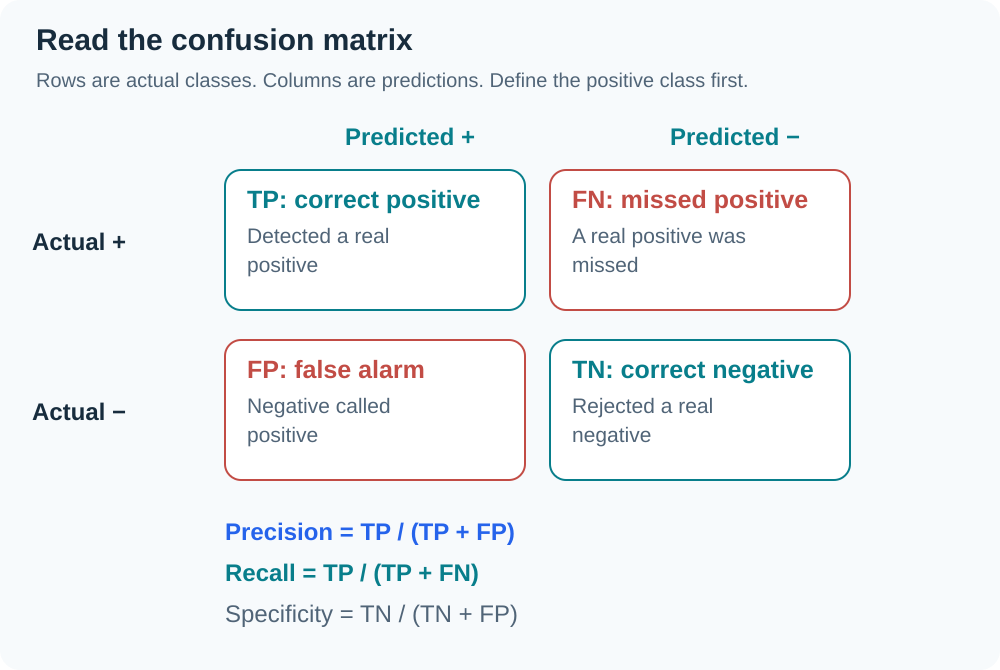
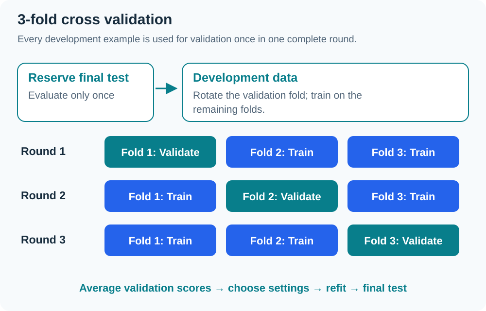
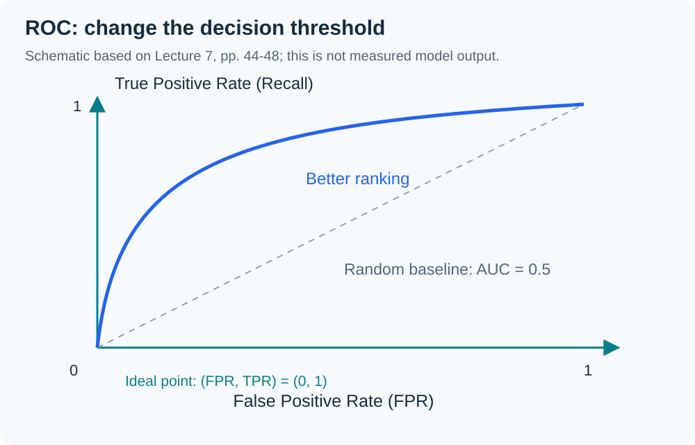

> Based on `INT182_Lecture7_Classification-ModelEvaluation_V4.pdf` (48 pages) and the G2 transcript dated 25 September 2026. References use PDF page numbers because embedded slide numbers from several sources are discontinuous. Worked results below are calculated from the slide data.

## 01 Classification and unseen data

The training set contains attributes and known classes. A learning algorithm builds a model (**induction**) and applies it to new examples (**deduction**). The goal is accurate prediction for unseen records (PDF pp. 5–16).

The Refund → Marital Status → Taxable Income example shows that several tree structures can fit the same data. For `Refund = No, Married, Income = 80K`, the tree reaches Married → **Cheat = No** without consulting Income.

Evaluation asks three questions: which metric to use, how to estimate it reliably, and how to compare models. *(From the transcript)* The lecturer also connects these questions with time, compute budgets, and practical use.

## 02 Underfitting, overfitting, and Occam’s Razor

| Condition | Training error | Test error | Meaning |
|---|---|---|---|
| Underfitting | High | High | Too simple to capture important patterns |
| Good generalization | Appropriately low | Close to training | Captures patterns useful for new data |
| Overfitting | Very low | Much higher than training | Fits noise or training-specific details |

PDF pp. 20–23 illustrate overfitting from noise and insufficient examples in parts of the input space. **Occam’s Razor** prefers the simpler model when generalization errors are similar, since complexity increases the chance of fitting accidents in the data. Missing values and classification costs are also practical issues on p. 18.

## 03 Confusion matrix: actual versus predicted

First define the Positive class of interest. Then distinguish correct and incorrect predictions (PDF pp. 26–28).

- ==True Positive (TP)==: actually positive, predicted positive.
- ==True Negative (TN)==: actually negative, predicted negative.
- ==False Positive (FP)==: actually negative, predicted positive — false alarm.
- ==False Negative (FN)==: actually positive, predicted negative — missed case.

The 12-record exercise on p. 29 gives TP = 4, TN = 4, FP = 2, FN = 2. Accuracy, Precision, and Recall are all **66.67%**: 8/12 or 4/6. Their equality follows from this example's counts, not from a general rule.

## 04 Interpret the formulas

Let `N = TP + TN + FP + FN` (PDF pp. 27–28, 33–34).

| Metric | Formula | Question |
|---|---|---|
| Accuracy | `(TP + TN) / N` | What fraction of all predictions is correct? |
| Error rate | `(FP + FN) / N` | What fraction is incorrect? |
| Precision | `TP / (TP + FP)` | Of predicted positives, how many are truly positive? |
| Recall / Sensitivity / TPR | `TP / (TP + FN)` | Of actual positives, how many were found? |
| Specificity / TNR | `TN / (TN + FP)` | Of actual negatives, how many were correctly rejected? |
| FPR | `FP / (FP + TN)` | Of actual negatives, how many caused false alarms? |
| FNR | `FN / (FN + TP)` | Of actual positives, how many were missed? |
| F1 | `2PR / (P + R)` or `2TP / (2TP + FP + FN)` | Balance precision and recall |

==F1== is a harmonic mean and does not directly use TN. It therefore cannot answer every evaluation question. If a denominator is zero, report the tool's handling convention rather than treating the ratio as an ordinary value.

## 05 Why high accuracy can still hide failure

PDF p. 30 gives 9,990 Class 0 examples and 10 Class 1 examples. Predicting Class 0 for every example achieves **99.9%** accuracy but finds none of Class 1. Inspect ==class imbalance== and the types of errors.

The exercise on p. 36 has TP = 90, FN = 210, FP = 140, TN = 9,560: 10,000 examples in total.

| Metric | Calculation | Result |
|---|---|---|
| Accuracy | 9650/10000 | 96.50% |
| Error rate | 350/10000 | 3.50% |
| Precision | 90/230 | 39.13% |
| Recall / Sensitivity | 90/300 | 30.00% |
| Specificity | 9560/9700 | 98.56% |
| F1 | 180/530 | 33.96% |

Accuracy looks high because negatives dominate. Recall reveals that 210 of 300 actual positives were missed. Multiple metrics expose problems hidden by a single score.

## 06 Costs and business goals

A cost matrix defines `C(i | j)` as the cost of predicting i when the actual class is j (PDF pp. 31–35). On p. 32 the costs are TP = −1, FN = 100, FP = 1, TN = 0:

- M1: TP 150, FN 40, FP 60, TN 250 → Accuracy 80%; Cost = `−150 + 4000 + 60 = 3910`.
- M2: TP 250, FN 45, FP 5, TN 200 → Accuracy 90%; Cost = `−250 + 4500 + 5 = 4255`.

M2 has better overall accuracy but a higher cost under this matrix.

| Concern | Useful metric |
|---|---|
| False alarms / FP | Precision |
| Missed cases / FN | Recall |
| Balance FP and FN | F1, with Precision and Recall reported separately |
| Ranking across thresholds | ROC-AUC |
| Probability quality | Log loss — mentioned without a calculation formula |

*(From the transcript)* Customer churn and lending examples show why false alarms and missed customers need not have equal costs.

## 07 Obtain a reliable performance estimate

PDF pp. 38–42 separate Training for fitting, Validation for selection, and Test for final evaluation. Results also depend on class distribution, misclassification cost, and dataset sizes.

| Method | Procedure |
|---|---|
| Holdout | One train/test split, such as 2/3 versus 1/3 |
| Random subsampling | Repeat holdout with several random splits |
| k-fold CV | Split into k folds; train on k−1 and evaluate on the remaining fold, rotating through all |
| Leave-one-out | k = N; reserve one example for evaluation each time |
| Stratified sampling | Preserve approximate overall class proportions in subsets |
| Bootstrap | Sample with replacement, so a record may appear repeatedly |

The p. 42 exercise has six Yes and six No examples. One **stratified 3-fold** allocation gives each fold two Yes and two No: `{1,2,3,4}`, `{6,9,5,7}`, `{10,11,8,12}`, using the exercise's row numbers. Rotate the evaluation fold.

`ระวัง` Folds used to compare settings serve as validation data. Do not repeatedly use a separate final test to choose hyperparameters.

## 08 Learning curves

A ==learning curve== shows how accuracy changes with training sample size (PDF p. 40). Arithmetic or geometric sampling schedules produce datasets of different sizes. Small samples can introduce bias and variance into estimates, so interpret scores together with the data sampling method.

## 09 ROC, thresholds, and AUC

==ROC== shows **TPR on the Y axis** versus **FPR on the X axis** while changing the threshold (PDF pp. 44–48). These are rates, not raw TP/FP counts.

- `(FPR, TPR) = (0,0)`: predict every example negative.
- `(1,1)`: predict every example positive.
- `(0,1)`: ideal point.
- Diagonal: random baseline.
- ==AUC== is the area under the ROC; ideal = 1, random baseline = 0.5.

When two ROC curves cross, neither model may win at every FPR. Consider the operating region and actual costs. AUC summarizes overall ranking performance but does not choose a threshold for you.

`ระวัง` Page 45 repeats the label FN in `FN = 0.88`; the negative-class totals imply that this should be TN, while FN = 0.5 belongs to the positive class.

## 10 Lecture announcements

*(From the transcript)* Phase 1 feedback is to be returned through the submitting group representative and used to improve Phases 2/3, especially references and system clarity. The final exam format was still under discussion in this lecture: an A4 note sheet, calculator, and printed dictionary were mentioned. W08 records the later clarification; use the latest official course announcement.

## Glossary

| Term | Meaning |
|---|---|
| Confusion matrix | Table comparing actual and predicted classes |
| Precision | TP/(TP+FP): true positives among predicted positives |
| Recall | TP/(TP+FN): actual positives found by the model |
| Specificity | TN/(TN+FP): actual negatives correctly rejected |
| F1 | Harmonic mean of precision and recall |
| Class imbalance | Large differences in class frequencies |
| Stratified sampling | Sampling that preserves class proportions |
| Bootstrap | Sampling with replacement |
| ROC | Curve of TPR versus FPR across thresholds |
| AUC | Area under ROC summarizing ranking performance |
| Learning curve | Performance plotted against training sample size |

## Chapter summary

| Topic | Remember |
|---|---|
| Confusion matrix | Define positive; distinguish actual/predicted and count TP/TN/FP/FN |
| Metrics | Read the denominator and consider error costs |
| Accuracy | Can mislead with imbalanced classes |
| Estimation | Split data, rotate folds, preserve class proportions |
| ROC-AUC | TPR versus FPR across thresholds; still choose an operating point |
