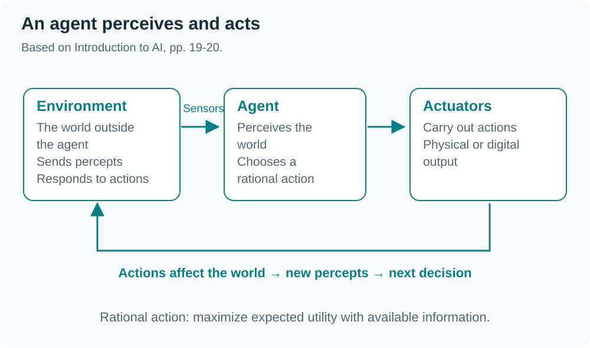
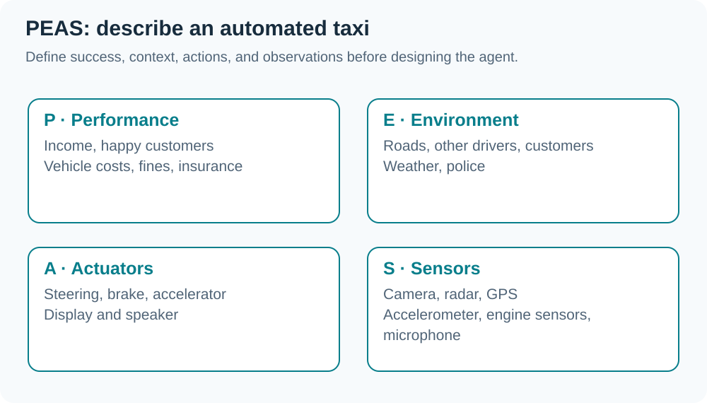

> Based on `INT182_Lecture8_Intro-AI.pdf` (51 pages), adapted from Berkeley CS188 and Duke COMPSCI 270, with the G2 online lecture transcript dated 2 October 2026. Diagrams summarize relationships in the slides. News and video examples reflect the lecture context, not a current-news verification.

## 01 What does AI mean in this course?

Slide 5 asks what AI is, how it developed, and how to design AI systems. Movies suggest robots capable of everything, while real systems often serve specific tasks: harvesting robots, inventory drones, speech recognition, and planning (slides 6–14, 36–37).

This chapter emphasizes ==acting rationally==: choosing actions appropriate to goals and available information. Human-like behavior and effective decision making are different evaluation dimensions. AI can excel at a task without resembling humans in every way.

## 02 History and foundations

Slides 16–18 connect AI with philosophy, mathematics, neuroscience, economics, control theory, psychology, and linguistics.

| Period | Overview in the slides |
|---|---|
| 1940–1950 | Circuit models of the brain and Turing's work |
| 1956 | Dartmouth adopts the term Artificial Intelligence |
| 1950–1970 | Game programs and theorem proving |
| 1970–1990 | Knowledge-based / Expert Systems and AI Winter |
| 1990–2012 | Statistical approaches, uncertainty, agents, and learning |
| 2012 onward | Big data, compute, and deep learning |

*(From the transcript)* Data, algorithms, and computing power jointly enable present systems. The slide history is an overview, not an exhaustive chronology.

## 03 Agents and rational agents

An ==agent== perceives its environment through **sensors** and acts on it through **actuators** (slides 19–20).



The agent function maps **percept sequences → actions** and is implemented by an agent program running on a machine. A ==rational agent== selects actions that maximize expected utility given available information. Rationality therefore depends on goals, uncertainty, and environmental constraints.

## 04 PEAS: define the task before designing

==PEAS== stands for Performance measure, Environment, Actuators, and Sensors (slides 22–24).



| Example | P | E | A | S |
|---|---|---|---|---|
| Pacman | −1/step, +10 food, +500 win, −500 die, +200 scared ghost | Game dynamics and ghosts | Left, right, up, down | Almost the entire state, except remaining power-pellet duration |
| Diagnosis support | Patient health, cost, reputation | Patients, staff, insurers, courts | Display, email | Keyboard/mouse in the slide model |

Sensors need not be physical cameras, and actuators need not be robot arms. Digital inputs and outputs can perform these roles.

## 05 Environment properties shape agent design

Slides 25–26 connect environment properties with appropriate techniques:

| Property | Design consequence |
|---|---|
| Fully / partially observable | Partial observation requires memory or internal state |
| Single / multi-agent | Account for other agents; random actions may help in some settings |
| Deterministic / stochastic | Uncertainty requires preparation for possible outcomes |
| Static / dynamic | Static worlds allow computation time; dynamic worlds can change while deciding |
| Discrete / continuous | Continuous time/control may require a continuously operating controller |
| Known / unknown physics | Unknown transition dynamics require exploration/learning |
| Known / unknown performance measure | An unclear goal requires observing or interacting with the principal |

*(From the transcript)* Autonomous driving involves other drivers, weather, and changing traffic, making it more complex than fixed commands in a fully specified world.

## 06 Reflex, state, and goal-based agents

| Agent | Action selection uses | Capability / limitation |
|---|---|---|
| Simple reflex | Current percept + condition-action rules | Cannot retain currently hidden information |
| Reflex with state | Internal state + world dynamics + action effects | Uses past information when the world is partially observed |
| Goal-based | State/model + goals + predicted action outcomes | Considers which action moves toward a goal |

Example from slide 28:

```python
class GoWestAgent(Agent):
    def getAction(self, percept):
        if Directions.WEST in percept.getLegalPacmanActions():
            return Directions.WEST
        else:
            return Directions.STOP
```

This rule moves west whenever possible, without reasoning about food or ghosts. A lookup table covering all situations could be impractically large, and Pacman has hidden information such as power-pellet duration (slides 27–33).

## 07 Four perspectives on AI

Slide 38 uses two axes: thinking/acting and human-like/rational.

| | Human-like | Rational |
|---|---|---|
| Thinking | Think like humans | Think rationally |
| Acting | Act like humans | Act rationally |

The **Turing Test** focuses on behavior difficult for a judge to distinguish from a human. The **Chinese room** asks whether rule-based symbol manipulation that produces correct answers entails understanding. ELIZA illustrates how limited conversational imitation can feel human to a user (slides 39–42). The chapter prioritizes evaluating task actions over resolving consciousness.

## 08 Traditional AI and related areas

AI includes symbolic/rule-based methods and learning from data. Slides 45–47 list:

- Search: find a solution path, such as solving a Rubik's cube.
- Constraint satisfaction / optimization: schedule meetings under constraints.
- Game playing: chess or poker.
- Logic / knowledge representation: represent facts and infer conclusions.
- Planning: arrange actions toward a goal.
- Probability / decision theory: decide under uncertainty.

These areas can overlap. *(From the transcript)* Knowledge-based rules are contrasted with fitting models from data; an AI system need not use machine learning.

## 09 Capabilities and limitations

Slides 35 and 43–44 use games and well-defined tasks as examples of success. Messy, ambiguous real-world tasks and common sense remain challenging. Explaining reasoning, adapting strategies, and transferring knowledge across contexts are comparison points with human abilities.

*(From the transcript)* News, generated images, and deployment examples prompt consideration of capability and reliability. Distinguish apparent behavior from performance demonstrated by testing.

## 10 Phase 2 project progress

*(From the transcript)* Progress should show improvement since Phase 1 and movement toward the objective, beyond adding slides:

| Dimension | Evidence to show |
|---|---|
| Algorithms | Clearer choices and reasons |
| Data | Sources, counts per class, tangible examples |
| Software | Started modules/code, with structural diagrams where available |
| References | Technical sources, domain knowledge, and related systems |
| Pipeline | Input-to-output steps and progress at each step |
| Evaluation | Train/test separation and evidence supporting reliable performance |

Examples such as 80/75/80 rock-paper-scissors images or several hundred spam/non-spam messages illustrate readiness; they are not mandatory minimum counts for every team. This lecture gives the presentation block as 19–26 October; W09 records the later specific announcement.

## 11 Final exam announcement

*(From the opening and closing transcript)* The lecturer permits **one A4 sheet with handwritten or printed notes on both sides**, a calculator, and a printed English dictionary. **Do not borrow or share notes in the exam room.** The note sheet will be collected after the exam.

This 2 October statement is clearer than the tentative discussion in W07. Use the course's official announcement for exam dates, times, and final rules.

## Glossary

| Term | Meaning |
|---|---|
| Agent | Entity that perceives and acts on its environment |
| Rational agent | Agent selecting actions to maximize expected utility |
| Percept | Information perceived through sensors |
| Actuator | Means through which an agent acts on the world |
| PEAS | Performance, Environment, Actuators, Sensors |
| Partially observable | Not all relevant world-state information is observable |
| Stochastic | Action outcomes involve uncertainty |
| Simple reflex agent | Uses the current percept and condition-action rules |
| Internal state | Internal information representing what is not currently observed |
| Goal-based agent | Chooses actions by considering goals |

## Chapter summary

| Topic | Key idea |
|---|---|
| AI | Several approaches; this chapter emphasizes acting rationally |
| Agent loop | Sensors → choose an action → Actuators → Environment |
| PEAS | Define performance, world, actions, and observations |
| Environment | Uncertainty, observability, and time shape design |
| Agent design | Reflex → internal state → goals |
| Phase 2 | Show data, algorithms, software, references, pipeline, and evaluation |
