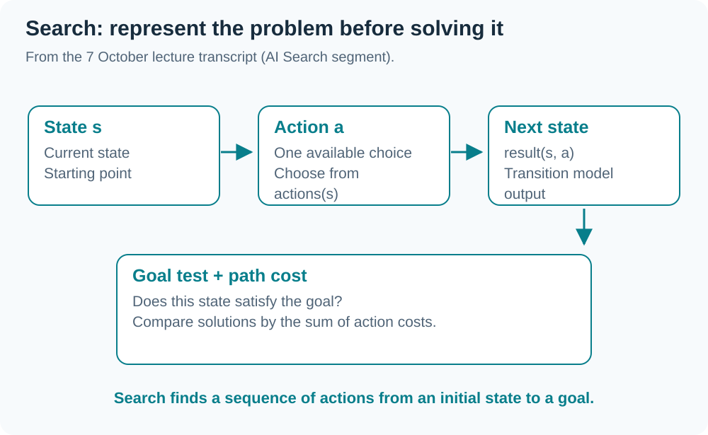
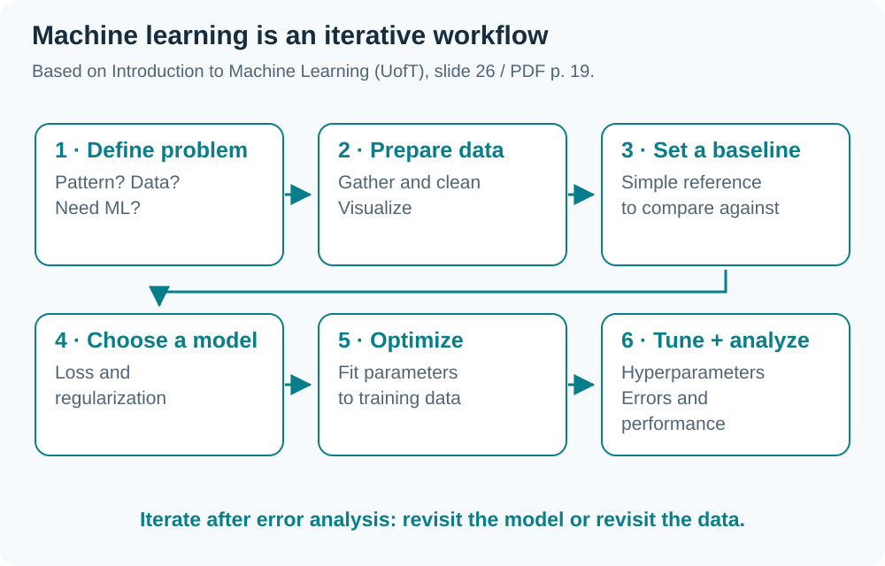
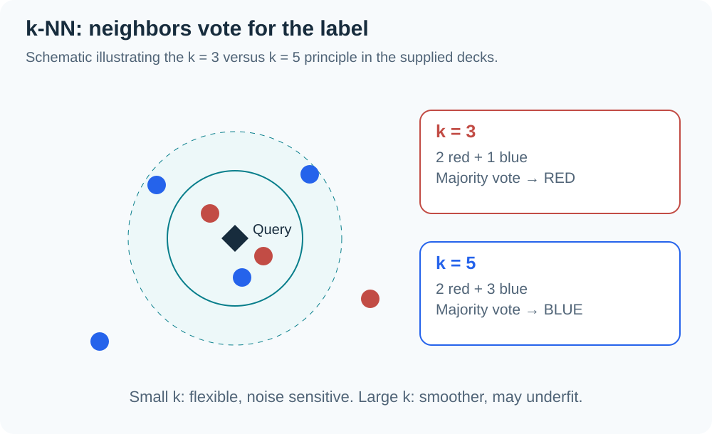

> Based on `INT182_Lecture9_IntroML_UnivToronto.pdf` (49 pages; references use the original printed slide numbers 1–55) and the **G1 lecture dated 7 October 2026**. The recording includes project guidance and AI Search before ML. The final ASR section is heavily distorted, so detailed k-NN content follows the slides. This summary covers the supplied deck without claiming every slide was taught that day. Transcript-only material is labeled.

## 01 Phase 2: evidence of progress

*(From the transcript)* Show a pipeline capable of delivering an output and progress since Phase 1: data sources/counts/labeling responsibility, selected models, implemented code/modules, a test plan, and references. Image projects should show actual examples; text projects should explain labeling criteria.

Pretrained models or APIs are acceptable when appropriate to the scope. Document the **model name, version, and prompt format**, plus the architecture showing frontend/cloud processing and reasons for the choices.

| G1 lecture announcement | Detail |
|---|---|
| Presentation file submission | 21 October 2026; no clear closing time in the transcript |
| Presentation | 22 October 2026, 13:00–18:00; room to be announced |
| Time per team | About 8 minutes presenting + 2–3 minutes of questions |
| Order | Randomized and announced on the evening of 20 October |
| Version | Present the file submitted on 21 October |

`ระวัง` This recording is from G1. Check Teams/LEB2 and the G2 conditions before applying these dates to your group.

## 02 AI Search: represent states and actions

*(From the transcript around 1:45–2:20; absent from the ML PDF)* Sliding 15-puzzle and route-finding examples use:

| Component | Meaning |
|---|---|
| State | Current configuration of the problem |
| Initial state | Starting point for finding a solution |
| Actions | Choices available in a state, such as moving a tile |
| Transition model | `result(s, a)` returns the state after action a in state s |
| Goal test | Check whether the goal condition is satisfied |
| Path cost | Total cost of a sequence of actions |

A solution is a **sequence of actions** from the initial state to a goal. Among several solutions, the lowest path cost may be preferred. Breadth-first, depth-first, and heuristics are mentioned, but distorted transcription prevents reliably adding detailed pseudocode or guarantees from this recording.

## 03 What is machine learning?

Slides 11–15 describe learning using ==Task (T)==, ==Experience (E)==, and ==Performance measure (P)==. A program learns when its performance at T, measured by P, improves with E.

Recognition and speech are slide examples where hand-written rules cannot easily cover all cases. ML instead lets an algorithm learn behavior from data/experience, useful for changing environments and complex patterns.

AI also includes symbolic reasoning, rule-based systems, and tree search, so not every AI system learns. ML overlaps with statistics; the slides emphasize predictive performance, scalability, and autonomy.

## 04 Learning types and applications

| Type | Learning signal | Objective |
|---|---|---|
| Supervised | Examples with labels | Predict outputs for new inputs |
| Unsupervised | Data without labels | Find interesting patterns/structure |
| Reinforcement | Agent-world interaction with rewards | Choose behavior yielding higher rewards |

Slides 16–23 illustrate computer vision, speech-to-text, NLP, games, and recommender systems, alongside history from perceptrons to probabilistic methods and deep learning. A task can combine several approaches; data modality alone does not determine the learning type.

## 05 ML workflow

Slide 26 orders the process: decide whether ML is needed → gather/organize data → establish a ==baseline== → choose model/loss/regularization → optimize → search hyperparameters → analyze performance and mistakes, then revisit the model or data.

Slide 24 recommends trying basic methods such as Logistic Regression before complex neural networks. Slides 27–28 explain that NumPy/vectorization and frameworks help computation, while debugging still requires understanding algorithms and their mathematics.

## 06 Input vectors and targets

Represent input as a vector `x ∈ R^d` so linear algebra applies. Images can use raw pixels or meaningful features (slides 30–34).

Write the training set as `{(x^(1), t^(1)), ..., (x^(N), t^(N))}`. Superscripts are **example indices, not powers**.

- Regression: t is real-valued.
- Classification: t belongs to the class set `{1, ..., C}`.
- Other tasks may have structured targets such as captions or images.

A useful representation makes proximity in feature space relevant to the task. Otherwise nearest examples can be numerically close without sharing the desired meaning.

## 07 1-Nearest Neighbor

For a new input x, find the nearest training example and copy its label (slides 35–39).

`x* = argmin distance(x^(i), x)` and `prediction = t*`.

Euclidean distance is `sqrt(sum_j((x_j - z_j)^2))`. If only distance ordering matters, the square root is unnecessary because it preserves the order of nonnegative values.

A decision boundary separates regions assigned to different classes. 1-NN can be visualized using Voronoi regions, but is sensitive to noise and incorrect labels.

## 08 k-NN and majority voting

Reduce 1-NN sensitivity by finding the **k nearest examples** and voting on their labels (slides 39–41).

This redrawn illustration explains the principle; it is not a measured model result. At k = 3, two red and one blue votes predict red. At k = 5, three blue and two red predict blue. Changing k can change predictions and boundary smoothness.

## 09 Choose k using validation

| k | Behavior | Risk |
|---|---|---|
| Small | Captures fine details | Overfitting / noise sensitivity |
| Large | Averages more examples for stability | Underfitting / missing important patterns |

Slide 42 gives the rule of thumb `k < sqrt(N)`, but a suitable value depends on the data. Choose it with a ==validation set== (slide 44), then use the **test set only at the end after selecting the configuration** to measure generalization. Do not repeatedly select k using test scores.

## 10 The curse of dimensionality

In high dimensions, most points are far apart and their distances can become similar. Obtaining genuinely close neighbors requires rapidly increasing amounts of data. Slides 45–47 illustrate covering a space with approximately `(1/ε)^d` regions.

Data may have a lower ==intrinsic dimension== than the recorded feature count: megapixel images can lie near a manifold with far fewer degrees of freedom. Neighborhood structure also depends on this intrinsic dimension.

## 11 Feature scaling

Nearest neighbors are sensitive to feature ranges: a large-unit feature may dominate distance. Slide 48 uses zero mean and unit variance:

`x_tilde_j = (x_j - μ_j) / σ_j`.

This is ==standardization==, although the slide heading says Normalization. It differs from the 0–1 min–max scaling in W05. The slide cautions that scale may carry meaning in some problems, so consider feature semantics before transforming it.

## 12 Computational cost and examples

Slide 49 describes naive k-NN with N examples and D features:

- “Training” has no model-fitting optimization, but the dataset must be stored.
- Distance computation per query: `O(ND)`.
- Sorting all distances: `O(N log N)`.
- Repeat this for every query and keep the training data in memory.

Slides 50–53 use digit recognition and Tiny Images to illustrate the value of data and a suitable similarity measure. The 0.63% versus 3% error figures belong to the cited shape-context research, not to experiments in this project.

The deck concludes that k-NN is simple and its complexity is controlled by k, but it suffers from high dimensions and query costs. The source course next moves to parametric models that learn a compact summary of the data.

## Glossary

| Term | Meaning |
|---|---|
| Task (T) | Task the system is expected to perform |
| Experience (E) | Data or experience from which learning occurs |
| Performance measure (P) | Criterion measuring whether task performance improves |
| Baseline | Initial reference method for comparison |
| Input vector | Representation of an input using d features |
| Decision boundary | Boundary separating regions assigned to different classes |
| k-NN | Find k nearest examples and combine their outputs |
| Intrinsic dimension | Effective degrees of freedom in the data structure |
| Standardization | Scale features using (x−mean)/standard deviation |
| Transition model | Rule mapping a state and action to the resulting state |
| Path cost | Total cost of the actions along a solution path |

## Chapter summary

| Topic | Key idea |
|---|---|
| ML | Performance on T measured by P improves with E |
| Search | Represent states/actions/transition/goal/cost from the transcript segment |
| k-NN | Represent → distance → k neighbors → vote |
| Choose k | Use validation; reserve final testing until choices are complete |
| Pitfalls | Noise, high dimensions, scale, and query cost |
| Phase 2 | G1 recording gives submission 21 Oct/presentation 22 Oct; verify group announcement |
